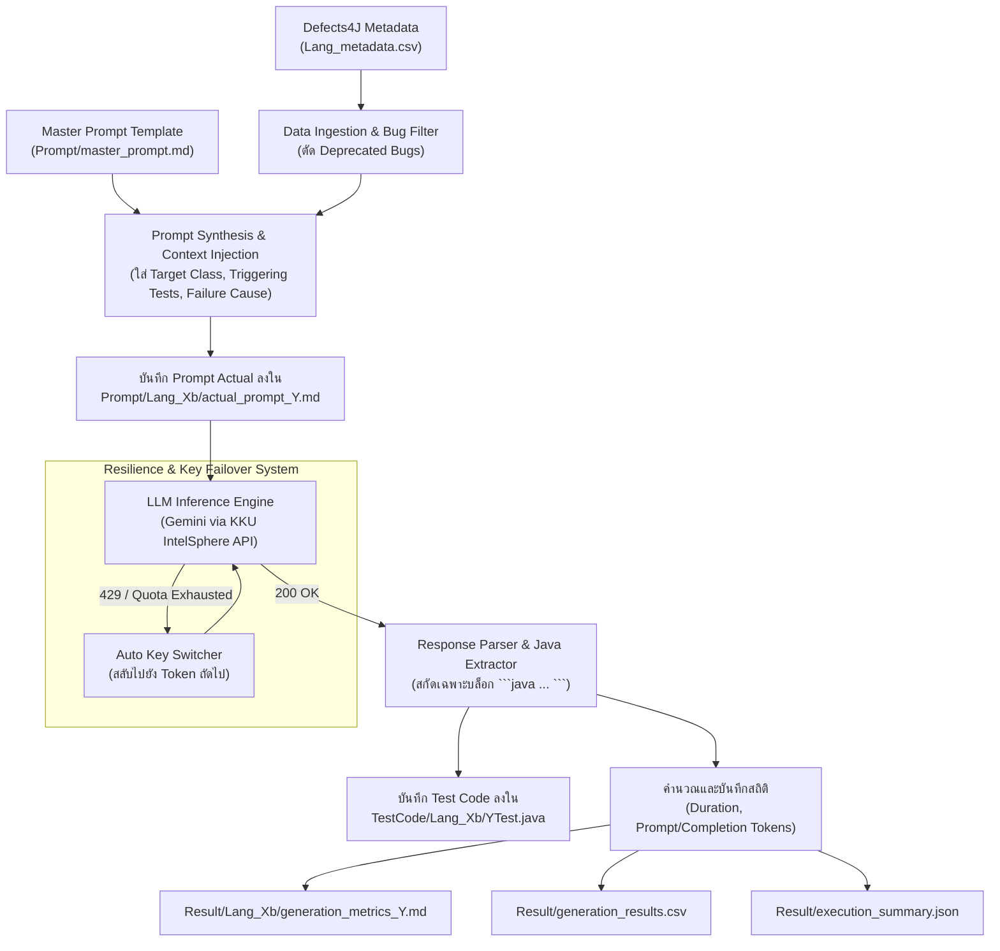

# 🤖 Gemini Test Generation Module

โมดูลสำหรับการสร้างชุดการทดสอบอัตโนมัติ (Automated Unit Test Generation) สำหรับ Java โดยใช้โมเดลตระกูล **Google Gemini** (เช่น `gemini-3.7-flash`, `gemini-1.5-flash`) ผ่าน KKU IntelSphere API / Google Generative Language Platform เพื่อนำไปประเมินผลบนชุดทดสอบมาตรฐาน **Defects4J**

---

## 📌 สารบัญ
- [1. ภาพรวมและบทบาทในโครงการ](#1-ภาพรวมและบทบาทในโครงการ)
- [2. โครงสร้างไดเรกทอรี](#2-โครงสร้างไดเรกทอรี)
- [3. สถาปัตยกรรมและหลักการทำงาน](#3-สถาปัตยกรรมและหลักการทำงาน)
- [4. กลยุทธ์การออกแบบ Prompt (Prompt Engineering)](#4-กลยุทธ์การออกแบบ-prompt-prompt-engineering)
- [5. ข้อมูลการวัดผลและสถิติ (Metrics Tracking)](#5-ข้อมูลการวัดผลและสถิติ-metrics-tracking)
- [6. วิธีการใช้งานและคำสั่งที่เกี่ยวข้อง](#6-วิธีการใช้งานและคำสั่งที่เกี่ยวข้อง)

---

## 1. ภาพรวมและบทบาทในโครงการ

โมดูลนี้ทำหน้าที่เป็นตัวแทนของแนวทาง **AI-Assisted Software Testing** โดยใช้ Large Language Model (LLM) จาก Google มาสร้าง Test Cases (JUnit 4) แบบอัตโนมัติ เพื่อนำผลลัพธ์ที่ได้ไปเปรียบเทียบกับ:
1. **โมเดล AI คู่แข่ง**: DeepSeek (`deepseek-v4-flash` / `deepseek-chat`)
2. **เครื่องมือสร้างชุดทดสอบอัตโนมัติแบบดั้งเดิม (Search-based & Property-based)**: EvoSuite และ jqwik

จุดเด่นของโมเดล Gemini ในงานนี้คือ ความเร็วในการประมวลผล (Low Latency), การเข้าใจบริบทขนาดใหญ่ (Long Context Window), และความสามารถในการวิเคราะห์โค้ดเพื่อสร้างเคสทดสอบที่ครอบคลุม Boundary Values และ Edge Cases

---

## 2. โครงสร้างไดเรกทอรี

```
Gemini/
├── README.md                                 # เอกสารอธิบายการทำงานของโมดูล Gemini (ไฟล์นี้)
├── Prompt/                                   # โฟลเดอร์จัดเก็บ Prompt Templates และ Prompt จริงที่ส่งให้ AI
│   ├── master_prompt.md                      # แม่แบบ Prompt หลักที่กำหนดบทบาท ข้อจำกัด และเงื่อนไขของ JUnit 4
│   └── <Project>_<BugID>b/                   # Prompt รายบั๊ก (เช่น Lang_1b, Chart_1b)
│       └── actual_prompt_<ClassName>.md      # เนื้อหา Prompt จริงหลัง Render พร้อม Context ของบั๊ก
├── Result/                                   # บันทึกผลลัพธ์ สถิติโทเคน และระยะเวลา
│   ├── execution_summary.json                # สรุปภาพรวมโทเคน เวลา และจำนวนบั๊กที่รันสำเร็จทั้งหมด
│   ├── generation_results.csv                # ตารางสรุปผลการรันระดับรายบั๊ก (Status, Duration, Tokens)
│   ├── generator_gemini_allprojects.log      # Log การรันการสร้างชุดทดสอบ
│   └── <Project>_<BugID>b/                   # ข้อมูลสถิติเชิงประจักษ์รายบั๊ก
│       └── generation_metrics_<ClassName>.md # รายงานเวลา, Token Usage (Prompt/Completion) และ Quota
└── TestCode/                                 # ซอร์สโค้ดไฟล์การทดสอบ JUnit 4 ที่ AI สร้างขึ้น
    └── <Project>_<BugID>b/
        └── <ClassName>Test.java              # ไฟล์คลาสทดสอบที่พร้อมนำไปคอมไพล์และรันใน Defects4J
```

---

## 3. สถาปัตยกรรมและหลักการทำงาน

กระบวนการสร้างชุดทดสอบผ่าน Gemini ถูกจัดการโดยสคริปต์ [run_llm_testgen.py](file:///d:/ProjectSQA/scripts/run_llm_testgen.py) ตามขั้นตอนดังต่อไปนี้:



### รายละเอียดขั้นตอนสำคัญ:
1. **Context Injection**: ดึงข้อมูลจาก `dataset/defects4j/Lang_metadata.csv` ได้แก่ คลาสเป้าหมาย (`classes_modified`), แพ็กเกจ, ชื่อเมธอดทดสอบที่ทำให้บั๊กแสดงอาการ (`tests_trigger`), และสาเหตุข้อผิดพลาด (`tests_trigger_cause`) มารวมเข้ากับ Prompt หลัก
2. **Strict Output Constraints**: บังคับให้โมเดลตอบกลับเป็น pure Java code ภายใต้บล็อก ` ```java ... ``` ` เท่านั้น ปราศจากคำอธิบาย เพื่อให้กระบวนการสกัดโค้ดเป็นไปอย่างสมบูรณ์โดยอัตโนมัติ
3. **Resilience & Key Failover**: สคริปต์รองรับ Multiple API Keys หากเกิดปัญหา Rate Limit (HTTP 429), Token Exhausted หรือ Quota เต็ม ระบบจะเปลี่ยนไปใช้คีย์สำรองลำดับถัดไปทันทีโดยอัตโนมัติ
4. **Empirical Metrics Logging**: จับเวลาด้วย System Clock และดึงค่าโทเคนจาก `resp_data["usage"]` บันทึกทั้งรูปแบบ Markdown รายบั๊ก และสรุปเป็น CSV

---

## 4. กลยุทธ์การออกแบบ Prompt (Prompt Engineering)

Prompt หลักของโมเดล Gemini อยู่ที่ [Gemini/Prompt/master_prompt.md](file:///d:/ProjectSQA/Gemini/Prompt/master_prompt.md) มีองค์ประกอบสำคัญ 4 ประการ:

1. **Role Definition (บทบาท)**:
   - กำหนดให้โมเดลสวมบทบาทเป็น *"Principal Software Quality Assurance Engineer specializing in Java Unit Testing with JUnit 4 and Defects4J benchmark suite"*
2. **Objective (วัตถุประสงค์คู่ขนาน)**:
   - **Coverage-Driven**: มุ่งเน้นการสร้างเคสทดสอบเพื่อให้ได้ Line Coverage และ Branch Coverage สูงสุด
   - **Fault-Driven**: สร้างเคสเพื่อดักจับและตรวจพบจุดบกพร่อง (Fault Detection) ที่แฝงอยู่ในโค้ด
3. **Technical & Compatibility Requirements**:
   - **Package Matching**: แพ็กเกจของคลาสทดสอบต้องตรงกับคลาสต้นฉบับ 100%
   - **Framework Constraint**: บังคับใช้ **JUnit 4** และ **JDK 8** เท่านั้น (ห้ามใช้ JUnit 5 หรือฟีเจอร์ JDK 9+)
   - **Naming Convention**: ต้องตั้งชื่อคลาสเป็น `<TargetClassName>Test` เสมอ
4. **Test Generation Strategy**:
   - ให้โมเดลใช้กระบวนการคิด Chain-of-Thought (CoT) ในการวิเคราะห์โครงสร้างคำสั่งเงื่อนไข (if/else, switch, try/catch)
   - ครอบคลุมค่าขอบเขต (Boundary values), ค่าว่าง (Empty string / array), ข้อมูล null, และข้อจำกัดทางคณิตศาสตร์ (Arithmetic limits เช่น Integer.MAX_VALUE)

---

## 5. ข้อมูลการวัดผลและสถิติ (Metrics Tracking)

ในไดเรกทอรี `Result/` มีการจัดเก็บสถิติเชิงประจักษ์อย่างละเอียด:

### 1. ไฟล์รายบั๊ก (`Result/<Project>_<BugID>b/generation_metrics_<ClassName>.md`)
บันทึกข้อมูลสำคัญ ได้แก่:
- **Generation Time (วินาที)**: ระยะเวลาตั้งแต่เริ่มส่งคำขอจนกระทั่งได้รับ Response ครบถ้วน
- **Input Tokens (Prompt Tokens)**: จำนวนโทเคนที่ใช้สำหรับ Prompt และ Context
- **Output Tokens (Completion Tokens)**: จำนวนโทเคนที่ใช้สำหรับโค้ด JUnit ที่สร้างขึ้น
- **Total Tokens**: ผลรวมโทเคนทั้งหมด
- **Token Quota Status**: จำนวนโควต้าประจำวันที่ใช้ไปและคงเหลือในสล็อตคีย์ที่เรียกใช้งาน

### 2. สรุปภาพรวม (`Result/generation_results.csv` และ `Result/execution_summary.json`)
ช่วยให้สามารถนำสถิติไปวิเคราะห์ต่อด้วย Pandas หรือสคริปต์เปรียบเทียบประสิทธิภาพระหว่างโมเดลได้อย่างง่ายดาย

---

## 6. วิธีการใช้งานและคำสั่งที่เกี่ยวข้อง

### การรันสร้าง Test Cases ด้วย Gemini

1. **ตรวจสอบความพร้อมของ API Key ในไฟล์ `.env`**:
   ```bash
   KKU_API_KEYS=sk_xxx1,sk_xxx2
   INTELSPHERE_GEMINI_MODEL=gemini-3.7-flash
   ```

2. **รันเฉพาะโมเดล Gemini สำหรับ Project Lang ทุกบั๊ก**:
   ```bash
   python scripts/run_llm_testgen.py --provider gemini --all
   ```

3. **รันเฉพาะบั๊กเดี่ยว (เช่น Lang Bug ID 1)**:
   ```bash
   python scripts/run_llm_testgen.py --provider gemini --bug 1
   ```

4. **บังคับสร้างใหม่ทับของเดิม (Force Overwrite)**:
   ```bash
   python scripts/run_llm_testgen.py --provider gemini --bug 1 --force
   ```

5. **Dry-Run (สร้างเฉพาะ Prompt เพื่อตรวจสอบความถูกต้องโดยไม่ยิง API)**:
   ```bash
   python scripts/run_llm_testgen.py --provider gemini --all --dry-run
   ```

---
*เอกสารนี้เป็นส่วนหนึ่งของโครงงาน CP353201 Software Quality Assurance (KKU)*
