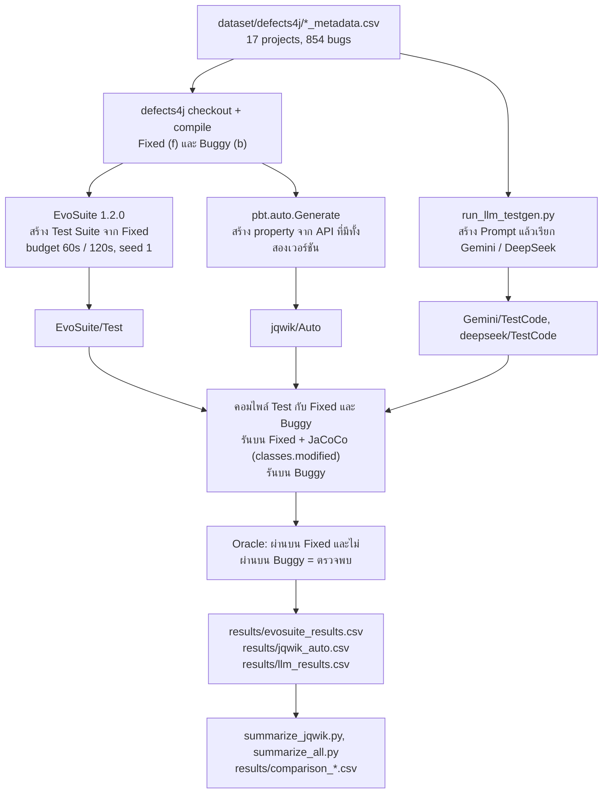

# ProjectSQA — AI-Assisted Testing vs. Automatic Test Case Generation Algorithms

โครงงานรายวิชา **CP353201 Software Quality Assurance** ภาคเรียน 1/2569 — **Section 2**
สาขาวิทยาการคอมพิวเตอร์ วิทยาลัยการคอมพิวเตอร์ มหาวิทยาลัยขอนแก่น
อาจารย์ประจำวิชา: ผศ.ดร.ชิตสุธา สุ่มเล็ก

เปรียบเทียบการสร้าง Unit Test อัตโนมัติ 4 เทคนิคบน **Defects4J 3.0.1 ครบ 17 projects รวม 854 active bugs**

| เทคนิค | ประเภท | Configuration ที่ทดลอง |
|---|---|---|
| EvoSuite 1.2.0 | Search-Based Software Testing (อัลกอริทึมเริ่มต้นของ EvoSuite 1.2.0 คือ DynaMOSA) | Search Budget 60 และ 120 วินาที, seed 1 |
| jqwik 1.7.4 + ตัวสร้าง property อัตโนมัติที่กลุ่มพัฒนา | Property-Based Testing | 200 และ 1,000 tries, seeds 1, 2, 3 |
| Gemini | Generative AI (LLM) | เก็บ Test Class ฉบับล่าสุดต่อ bug; บาง bug มีการสร้างซ้ำ |
| DeepSeek | Generative AI (LLM) | เก็บ Test Class ฉบับล่าสุดต่อ bug; บาง bug มีการสร้างซ้ำ |

ตัวเลขผลทดลองทั้งหมดในไฟล์นี้คำนวณจาก CSV ใน [`results/`](results/) ณ commit `2ed73bd` (`2ed73bd35362cd4444120d9008875eb50d3da5e1`) repository นี้ยังไม่มี git tag

## สารบัญ

1. [สมาชิกกลุ่ม](#1-สมาชิกกลุ่ม)
2. [สิ่งที่ส่งและหลักฐานตามข้อกำหนดรอบที่ 2](#2-สิ่งที่ส่งและหลักฐานตามข้อกำหนดรอบที่-2)
3. [โครงสร้าง repository](#3-โครงสร้าง-repository)
4. [ภาพรวม Pipeline](#4-ภาพรวม-pipeline)
5. [สภาพแวดล้อมและ Configuration](#5-สภาพแวดล้อมและ-configuration)
6. [การติดตั้งและตรวจความพร้อม](#6-การติดตั้งและตรวจความพร้อม)
7. [เส้นทาง A: ตรวจสอบและสรุปผลเดิม](#7-เส้นทาง-a-ตรวจสอบและสรุปผลเดิม)
8. [เส้นทาง B: สร้าง Test และทดลองใหม่](#8-เส้นทาง-b-สร้าง-test-และทดลองใหม่)
9. [วิธีประเมินผล](#9-วิธีประเมินผล)
10. [ผลการทดลอง](#10-ผลการทดลอง)
11. [ข้อจำกัดของการเปรียบเทียบ](#11-ข้อจำกัดของการเปรียบเทียบ)
12. [ปัญหาที่พบและสิ่งที่เรียนรู้](#12-ปัญหาที่พบและสิ่งที่เรียนรู้)
13. [ขั้นตอน Demo](#13-ขั้นตอน-demo)
14. [สถานะการตรวจสอบคำสั่งในไฟล์นี้](#14-สถานะการตรวจสอบคำสั่งในไฟล์นี้)

---

## 1. สมาชิกกลุ่ม

| รหัสนักศึกษา | ชื่อ-นามสกุล | Section | ส่วนที่รับผิดชอบ |
|---|---|---:|---|
| 673380388-2 | กฤษฎา นามมนต์เทียน | 2 | jqwik (Property-Based Testing) และตัวสร้าง property อัตโนมัติ |
| 673380392-1 | กานดิทัต นามสุดตา | 2 | EvoSuite (Search-Based Software Testing) |
| 673380402-4 | ดรัณภพ สุริเตอร์ | 2 | Gemini และ DeepSeek (การสร้าง Test ด้วย Generative AI) |

---

## 2. สิ่งที่ส่งและหลักฐานตามข้อกำหนดรอบที่ 2

| ข้อกำหนด (หัวข้อ 2.2) | หลักฐานใน repository | สถานะ |
|---|---|---|
| (1) พัฒนาอัลกอริทึม 2 ตัว รันกับ Defects4J ทุกรายการ บันทึกผล วัด Coverage | EvoSuite: [`scripts/run_evosuite.py`](scripts/run_evosuite.py), [`scripts/run_benchmark.py`](scripts/run_benchmark.py), [`EvoSuite/`](EvoSuite/), [`results/evosuite_results.csv`](results/evosuite_results.csv) <br> jqwik: [`scripts/run_jqwik.py`](scripts/run_jqwik.py), [`jqwik/Harness/`](jqwik/Harness/), [`jqwik/Auto/`](jqwik/Auto/), [`results/jqwik_auto.csv`](results/jqwik_auto.csv) | มีผลประเมินครบ 854 bugs ทุก configuration |
| (2) ใช้ Prompt สร้าง Test ด้วย AI 2 ตัว รันและวัดผล | [`scripts/run_llm_testgen.py`](scripts/run_llm_testgen.py), [`scripts/run_llm_eval.py`](scripts/run_llm_eval.py), [`Gemini/`](Gemini/), [`deepseek/`](deepseek/), [`results/llm_results.csv`](results/llm_results.csv) | มีผลประเมินครบ 854 bugs ต่อโมเดล |
| (3) เปรียบเทียบ วิเคราะห์ สรุปสิ่งที่เรียนรู้และปัญหา | [`scripts/summarize_all.py`](scripts/summarize_all.py), [`results/comparison_overall.csv`](results/comparison_overall.csv), [`results/comparison_projects.csv`](results/comparison_projects.csv), หัวข้อ [10](#10-ผลการทดลอง)–[12](#12-ปัญหาที่พบและสิ่งที่เรียนรู้) ของไฟล์นี้ | มี |
| (4) รายงานฉบับสมบูรณ์ | [`report/ProjectSQA_Report_final.pdf`](report/ProjectSQA_Report_final.pdf) | ระบุลิงก์แล้ว; ยังไม่ได้ยืนยันการเข้าถึงไฟล์บน GitHub ในการตรวจครั้งนี้ |
| (4) Source code | [`scripts/`](scripts/), [`jqwik/Harness/src/`](jqwik/Harness/src/), [`docker/`](docker/) | มี |
| (4) Test code | [`EvoSuite/Test/`](EvoSuite/Test/), [`jqwik/Auto/`](jqwik/Auto/), [`Gemini/TestCode/`](Gemini/TestCode/), [`deepseek/TestCode/`](deepseek/TestCode/) | มี (รายละเอียดในหัวข้อ 3) |
| (4) ผลการทดสอบ | [`results/`](results/), `EvoSuite/Result_Round*/`, `jqwik/Result_auto_Round*/`, `Gemini/Result/`, `deepseek/Result/` | มี |
| (4) ภาพประกอบ/Diagram | Diagram ในหัวข้อ [4](#4-ภาพรวม-pipeline) ของไฟล์นี้ | มีเฉพาะ Diagram นี้ กราฟผลทดลองอยู่ในรายงาน ไม่ได้เก็บเป็นไฟล์ใน repository |
| (4) Prompt | [`Gemini/Prompt/master_prompt.md`](Gemini/Prompt/master_prompt.md), [`deepseek/Prompt/master_prompt.md`](deepseek/Prompt/master_prompt.md) (เนื้อหาเหมือนกัน) และ Prompt จริงราย bug ใน `Gemini/Prompt/<Project>_<Bug>b/`, `deepseek/Prompt/<Project>_<Bug>b/` | มีครบ 854 ไฟล์ต่อโมเดล |
| (4) Configuration | [`docker/Dockerfile`](docker/Dockerfile), [`docker/docker-compose.yml`](docker/docker-compose.yml), [`.env.example`](.env.example), `EvoSuite/Result_Round*/<Project>_<Bug>/budget*_seed1/config.json`, หัวข้อ [5](#5-สภาพแวดล้อมและ-configuration) | มีค่าที่ใช้ในสคริปต์และ config.json; โฟลเดอร์ Configuration แยกยังว่าง แต่ไม่ใช่ข้อกำหนดว่าต้องเก็บซ้ำในโฟลเดอร์นั้น |
| (4) Presentation | — | **ยังไม่มีใน repository** |
| (4) Demo | ขั้นตอนในหัวข้อ [13](#13-ขั้นตอน-demo) | มีขั้นตอนสำหรับนำเสนอ ยังต้องทดลอง Demo จริงก่อนนำเสนอ; วิดีโอเป็นหลักฐานเสริม ไม่ได้ระบุว่าบังคับใน PDF |
| ชื่อ รหัสสมาชิก และคำอธิบายใน README | หัวข้อ [1](#1-สมาชิกกลุ่ม) | มี |

ต้องจัดทำ Presentation และนำเสนอ Demo ตามข้อกำหนดรอบที่ 2 README นี้ใช้แทนสองรายการนั้นไม่ได้ PDF ไม่ได้กำหนดว่าต้องส่งวิดีโอ Demo หรือสร้างโฟลเดอร์ Configuration แยก หากเก็บค่าที่ใช้ไว้ในไฟล์อื่นครบและอ้างอิงได้ ก็ใช้เป็นหลักฐานการทำซ้ำได้

---

## 3. โครงสร้าง repository

```
ProjectSQA/
├── README.md
├── .env.example                 ตัวอย่างตัวแปรสำหรับบริการ AI (ไม่มีค่าจริง)
├── docker/                      Dockerfile และ docker-compose.yml
├── dataset/defects4j/           <Project>_metadata.csv ของ 17 projects (รวม 854 bugs)
├── lib/jqwik/                   jqwik 1.7.4 และ JUnit Platform Console Standalone 1.9.3
├── scripts/
│   ├── check_env.sh             ตรวจ Java, timezone, Defects4J ด้วย Lang-1
│   ├── run_evosuite.py          EvoSuite: 1 bug / 1 budget / 1 seed (สร้าง + ประเมิน)
│   ├── run_benchmark.py         วนรัน run_evosuite.py ทุก project พร้อม resume
│   ├── summarize_evosuite.py    สรุป EvoSuite แบบนับแถว (ดูข้อควรระวังในหัวข้อ 7.3)
│   ├── run_jqwik.py             jqwik: สร้าง property + ประเมิน
│   ├── run_jqwik_auto_all.sh    jqwik ทุก project: controls → Round 1 → Round 2 → สรุป
│   ├── run_jqwik_all.sh         jqwik โหมด property ที่เขียนเอง (ไม่ได้ใช้ในผลหลัก)
│   ├── summarize_jqwik.py       สรุป jqwik ราย bug และราย project
│   ├── run_llm_testgen.py       สร้าง Prompt และเรียก Gemini/DeepSeek
│   ├── start_background_gen.*   เรียก run_llm_testgen.py เบื้องหลังบน Windows
│   ├── run_llm_eval.py          ประเมิน Test ของ Gemini/DeepSeek
│   └── summarize_all.py         ตารางเปรียบเทียบทั้ง 4 เทคนิค
├── EvoSuite/
│   ├── Test/<Project>_<Bug>/budget{60,120}_seed1/     Test ที่ EvoSuite สร้าง (825 bugs)
│   ├── Result_Round1/<Project>_<Bug>/budget60_seed1/  config.json, run.log, jacoco.csv, jacoco.exec
│   └── Result_Round2/<Project>_<Bug>/budget120_seed1/ เช่นเดียวกัน
├── jqwik/
│   ├── README.md                รายละเอียดตัวสร้าง property และ Oracle
│   ├── Harness/                 source ของตัวสร้าง property (pbt.auto) และ SeedControlHook
│   ├── Auto/<Project>_<Bug>/    property ที่สร้างอัตโนมัติ + AUTO_GENERATED.json (854 bugs)
│   ├── Controls/                ชุดควบคุม Positive / Negative / FalseAlarm
│   ├── Test/                    property ที่เขียนเอง (Lang-1, Lang-3) ใช้เป็นชุดควบคุม
│   ├── Result_auto_Round1/<Project>_<Bug>/tries200_seed{1,2,3}/   properties.json, run.log, jacoco.csv
│   ├── Result_auto_Round2/<Project>_<Bug>/tries1000_seed{1,2,3}/  เช่นเดียวกัน (838 จาก 854 bugs)
│   └── Result_control_*_Round1/ ผลของชุดควบคุม
├── Gemini/  และ  deepseek/
│   ├── Prompt/master_prompt.md              Prompt Template
│   ├── Prompt/<Project>_<Bug>b/             Prompt จริงที่ส่งให้โมเดล
│   ├── TestCode/<Project>_<Bug>b/           Test Class ที่โมเดลสร้าง (1 ไฟล์ต่อ bug)
│   ├── Result/<Project>_<Bug>b/             generation_metrics_*.md, eval.log, eval.json
│   ├── Result/generation_results.csv        บันทึกทุกคำขอที่สำเร็จ (token, เวลา, โมเดล)
│   └── Result/generator_*_allprojects.log   log การสร้าง (UTF-16)
└── results/                     CSV ผลรวมของทุกเทคนิค
```

ไฟล์ที่ควรรู้ว่า **ไม่ได้ใช้ในผลที่รายงาน**:

- `EvoSuite/Result_Round1/results.csv` และ [`results/llm_coverage_results.csv`](results/llm_coverage_results.csv) เป็นไฟล์จากการทดลองช่วงแรก มี 1 แถว
- `jqwik/Test/Lang_1/NumberUtilsPropertyTest.java` เป็น property จากรอบแรกก่อนเขียน pipeline ใหม่
- [`Gemini/README.md`](Gemini/README.md) และ [`deepseek/README.md`](deepseek/README.md) เขียนไว้ตั้งแต่ช่วงที่ทดลองเฉพาะ Lang ยังไม่ได้ปรับเป็น 17 projects และมีลิงก์ที่ชี้ไปเครื่องของผู้เขียน ให้ยึดไฟล์นี้เป็นหลัก
- `Gemini/Result/execution_summary.json` และ `deepseek/Result/execution_summary.json` ถูกเขียนทับทุกครั้งที่รัน จึงเป็นยอดของการรันครั้งสุดท้ายเท่านั้น ยอดรวมให้คำนวณจาก `generation_results.csv`
- `EvoSuite/Code/`, `EvoSuite/Configuration/`, `jqwik/Code/`, `jqwik/Configuration/` เป็นโฟลเดอร์ว่าง

โฟลเดอร์ผลราย bug ที่ไม่ครบ 854:

- `EvoSuite/Test/` มี 825 bugs เพราะสคริปต์คัดลอก Test เข้า repository เฉพาะการรันที่ไปถึงขั้นรันบน Buggy Version สำเร็จ
- `jqwik/Result_auto_Round2/` ไม่มีโฟลเดอร์ของ 16 bugs (Compress-21, Csv-3, Jsoup-15/17/24/35/38/55/62/64/76, Math-31, Mockito-11/12/15/19) แต่ผลของ bugs เหล่านี้มีครบใน [`results/jqwik_auto.csv`](results/jqwik_auto.csv)

---

## 4. ภาพรวม Pipeline



---

## 5. สภาพแวดล้อมและ Configuration

### 5.1 ซอฟต์แวร์ (จาก [`docker/Dockerfile`](docker/Dockerfile) และ [`lib/jqwik/`](lib/jqwik/))

| รายการ | ค่า |
|---|---|
| Base image | Ubuntu 22.04 |
| Java | OpenJDK 11 เป็นค่าเริ่มต้น (`JAVA_HOME=/opt/jdk11`) และติดตั้ง OpenJDK 8 ไว้ที่ `/opt/jdk8` |
| Timezone | `America/Los_Angeles` (ตามที่ Defects4J กำหนด) |
| Defects4J | v3.0.1 ที่ `/opt/defects4j` |
| EvoSuite | 1.2.0 (`evosuite-1.2.0.jar` และ `evosuite-standalone-runtime-1.2.0.jar` ที่ `/opt/evosuite`) |
| JaCoCo | 0.8.12 ที่ `/opt/jacoco` |
| jqwik | 1.7.4 (jar อยู่ใน `lib/jqwik/`) |
| JUnit | JUnit Platform Console Standalone 1.9.3 (jqwik และ Test ของ AI), JUnit 4.12 ของ Defects4J (EvoSuite และ Test ของ AI) |
| Python | python3 ของ Ubuntu 22.04 พร้อม `pandas` และ `python-dotenv` (ไม่ได้ตรึงเวอร์ชัน) |

เครื่องที่กลุ่มใช้ทดลองคือ Windows + Docker Desktop (WSL2) Dockerfile รองรับทั้ง amd64 และ arm64 และ `docker-compose.yml` มีบรรทัด `platform: linux/amd64` ให้เปิดใช้บน Apple Silicon แต่กลุ่ม **ยังไม่ได้ทดสอบบน macOS หรือ Linux โดยตรง**

### 5.2 ทรัพยากร

- **หน่วยความจำ:** jqwik รัน JVM ด้วย `-Xmx1g` และรันซ้ำด้วย `-Xmx3g` เมื่อ JVM ล้ม ส่วนการประเมิน Test ของ AI ใช้ `-Xmx768m` (ค่าในสคริปต์) เครื่องที่กลุ่มใช้มี RAM 16 GB กำหนดให้ Docker ใช้ 11 GB และรัน jqwik ด้วย `--jobs 4` การรัน 19 งานพร้อมกันเมื่อ Docker มี 7 GB ทำให้ container ถูกปิดเพราะหน่วยความจำไม่พอ
- **EvoSuite:** กลุ่มใช้ `--workers 1` ค่ามากกว่า 1 ยังไม่ได้ทดสอบ (ระบุไว้ใน help ของสคริปต์)
- **การประเมิน AI:** คำสั่งใน README ใช้ `--jobs 4` เป็นค่าที่แนะนำสำหรับเริ่มทำซ้ำ ไม่ได้ยืนยันว่าการประเมิน AI เดิมทุกงานใช้ค่านี้ จำนวนงานพร้อมกันของ jqwik, EvoSuite และ AI เป็นคนละ configuration ควรปรับตามทรัพยากรจริง
- **พื้นที่จัดเก็บ:** working tree ของ repository ประมาณ 1.2 GB ขนาด Docker image และ volume `d4j_work` (ที่ checkout bugs) ไม่ได้วัดไว้

### 5.3 Configuration ของการทดลอง

| เทคนิค | ค่าที่ใช้ | ที่มา |
|---|---|---|
| EvoSuite | `-Dcriterion=LINE:BRANCH:EXCEPTION`, `-Dsearch_budget=60` (Round 1) และ `120` (Round 2), `-seed 1`, ไม่ระบุ `-Dalgorithm` (CSV บันทึกเป็น `default`), JaCoCo โหมด offline, ใช้ `--evo-jvm-cp` กับทุก project ยกเว้น Lang | `run_evosuite.py`, `run_benchmark.py`, `config.json` ราย bug |
| EvoSuite timeout | สร้าง Test ต่อคลาส: `budget × 3 + 300` วินาที, คอมไพล์และรัน Test แต่ละขั้น: 600 วินาที | `run_evosuite.py` |
| jqwik | Round 1: `--tries 200`, Round 2: `--tries 1000`, `--seeds 1,2,3`, `--prop-budget 5` (วินาทีต่อ property), `--max-methods 150` (property ต่อคลาส), `--timeout 600` (วินาทีต่อ JVM บวก 5 วินาทีต่อ property) | `run_jqwik_auto_all.sh`, `run_jqwik.py` |
| Gemini / DeepSeek (สร้าง) | `temperature 0.2`, system prompt คงที่, timeout 180 วินาทีต่อคำขอ, ไม่มี seed | `run_llm_testgen.py` |
| Gemini / DeepSeek (ประเมิน) | `--timeout 180` วินาทีต่อ JVM, รันด้วย engine `junit-vintage` | `run_llm_eval.py` |
| Target Classes | `classes_modified` ใน `dataset/defects4j/<Project>_metadata.csv` EvoSuite และ jqwik ใช้ทุกคลาส ส่วน AI ใช้เฉพาะคลาสแรก (127 bugs มีมากกว่า 1 คลาส) | สคริปต์ทั้งสามชุด |
| ขอบเขต Coverage | JaCoCo เฉพาะคลาสใน `classes_modified` (รวม inner class) วัดขณะรันบน Fixed Version | `jacoco_coverage()` |

### 5.4 บริการ AI

`run_llm_testgen.py` เรียก endpoint รูปแบบ OpenAI (`<base_url>/chat/completions`) และอ่านค่าจากไฟล์ `.env` ที่ root ของ repository

| ตัวแปร | ความหมาย | ค่าที่ใช้ในการทดลอง (จาก log และ `generation_results.csv`) |
|---|---|---|
| `KKU_API_KEYS` | API key คั่นด้วยจุลภาค (รองรับ `KKU_API_KEY_1`, `KKU_API_KEY_2`, … ด้วย) สคริปต์สลับ key อัตโนมัติเมื่อโควตาหมด | `<YOUR_API_KEY_1>,<YOUR_API_KEY_2>` |
| `INTELSPHERE_BASE_URL` | base URL ของบริการ | `https://gen.ai.kku.ac.th/api/v1` |
| `INTELSPHERE_GEMINI_MODEL` | ชื่อโมเดล Gemini | `gemini-3.5-flash-lite` (783 คำขอ) และ `gemini-3.7-flash` (91 คำขอ) |
| `INTELSPHERE_DEEPSEEK_MODEL` | ชื่อโมเดล DeepSeek | `deepseek-v4-flash` (863 คำขอ) |

ข้อควรระวัง:

- ค่าใน [`.env.example`](.env.example) (`https://intelsphere.kku.ac.th/v1`, `gemini-1.5-flash`, `deepseek-chat`) **ไม่ตรงกับค่าที่ใช้ทดลองจริง** หากต้องการทำซ้ำให้ใช้ค่าในตารางข้างบน
- ถ้าไม่กำหนดตัวแปร สคริปต์ใช้ค่าเริ่มต้น `https://gen.ai.kku.ac.th/api/v1`, `gemini-3.7-flash`, `deepseek-v4-flash`
- ไฟล์ `.env` อยู่ใน `.gitignore` ห้าม commit และห้ามใส่ key จริงในไฟล์อื่น
- log การสร้างใน repository แสดง key แบบปิดบัง (4 ตัวแรกและ 4 ตัวท้าย)
- สคริปต์ปิดการตรวจสอบใบรับรอง TLS ขณะเรียก API (`ssl._create_unverified_context`)

---

## 6. การติดตั้งและตรวจความพร้อม

คำสั่งในหัวข้อนี้ขึ้นต้นด้วย `[host]` เมื่อรันบนเครื่องผู้ใช้ และ `[container]` เมื่อรันภายใน container ที่ `/workspace`

```bash
# [host] 1) clone และเข้า working directory
git clone https://github.com/kaokao31/ProjectSQA.git
cd ProjectSQA
git checkout 2ed73bd      # ไม่บังคับ: ใช้ผลชุดเดียวกับที่รายงาน

# [host] 2) build และ start container (ครั้งแรกต้องดาวน์โหลด Defects4J, EvoSuite, JaCoCo)
docker compose -f docker/docker-compose.yml up -d --build

# [host] 3) เข้า shell ใน container
docker compose -f docker/docker-compose.yml exec sqa bash

# [container] 4) ตรวจความพร้อม
bash scripts/check_env.sh
```

| ขั้นตอน | ผลที่ควรเกิด | วิธีตรวจว่าสำเร็จ |
|---|---|---|
| 2 | image `sqa-d4j:latest` และ container `sqa_d4j` | `docker ps` เห็น `sqa_d4j` |
| 3 | shell อยู่ที่ `/workspace` ซึ่ง mount จาก repository | `ls` เห็น `scripts/`, `results/` |
| 4 | แสดง Java 11, timezone `PST`/`PDT`, ข้อมูล Lang-1, checkout และ compile `/work/Lang_1b` สำเร็จ, trigger test ล้มเหลวบน Buggy Version, และ `classes.modified` | ไม่มีข้อความ error จาก `defects4j checkout` และ `defects4j compile` และ `defects4j test` รายงาน `Failing tests` มากกว่า 0 |

Docker Compose ต้องเป็นรุ่นที่รองรับ `env_file` แบบ `path`/`required` (ไฟล์ `.env` ไม่บังคับ)

---

## 7. เส้นทาง A: ตรวจสอบและสรุปผลเดิม

เส้นทางนี้ใช้ CSV และ Test Code ที่เก็บไว้ใน repository ไม่สร้าง Test ใหม่และไม่เรียก AI

### 7.1 สร้างตารางสรุปจาก CSV เดิม

รันภายใน container หรือบนเครื่องที่มี Python 3 และ pandas ก็ได้ โดยอยู่ที่ root ของ repository

```bash
python3 scripts/summarize_jqwik.py --check-controls
python3 scripts/summarize_jqwik.py --csv 'jqwik_auto*.csv'
python3 scripts/summarize_all.py
```

| คำสั่ง | ไฟล์ที่เขียน | ผลที่ควรได้ |
|---|---|---|
| `--check-controls` | ไม่เขียนไฟล์ | `[PASS]` 3 บรรทัด (negative, false-alarm, positive) |
| `summarize_jqwik.py --csv 'jqwik_auto*.csv'` | `results/jqwik_auto_summary_bugs.csv`, `results/jqwik_auto_summary_projects.csv` | สถานะราย bug ตามตารางในหัวข้อ 10.3 |
| `summarize_all.py` | `results/comparison_overall.csv`, `results/comparison_projects.csv` | ทุกเทคนิค `bugs = 854` และจำนวนที่ตรวจพบ 265 / 275 / 216 / 230 / 31 / 34 |

วิธีตรวจว่าสำเร็จ: หลังรันทั้งสามคำสั่ง `git status --short results/` ต้องไม่แสดงไฟล์ที่เปลี่ยน เพราะผลที่คำนวณใหม่ต้องเท่ากับไฟล์ที่ commit ไว้

### 7.2 ตรวจจำนวน bugs โดยจัดการรายการซ้ำ

CSV ทุกไฟล์เป็นแบบต่อท้าย (append) การรันซ้ำจึงทำให้มีมากกว่า 1 แถวต่อ bug **จำนวนแถวไม่ใช่จำนวน bugs**

| ไฟล์ | จำนวนแถว | คีย์ที่ไม่ซ้ำ | จำนวนคีย์ที่ควรได้ |
|---|---:|---|---:|
| `results/evosuite_results.csv` | 1,915 | `project, bug_id, search_budget, seed` | 1,708 (854 × 2 budget) |
| `results/jqwik_auto.csv` | 5,130 | `project, bug_id, round, tries, seed` | 5,124 (854 × 2 รอบ × 3 seeds) |
| `results/llm_results.csv` | 1,712 | `tool, project, bug_id` | 1,708 (854 × 2 โมเดล) |
| `Gemini/Result/generation_results.csv` | 874 | `bug_id, target_class` (ไฟล์นี้ไม่มีคอลัมน์ project) | 854 |
| `deepseek/Result/generation_results.csv` | 863 | `bug_id, target_class` | 854 |

```bash
python3 - <<'EOF'
import pandas as pd
checks = [("results/evosuite_results.csv", ["project", "bug_id", "search_budget", "seed"]),
          ("results/jqwik_auto.csv", ["project", "bug_id", "round", "tries", "seed"]),
          ("results/llm_results.csv", ["tool", "project", "bug_id"])]
for path, key in checks:
    d = pd.read_csv(path, dtype=str)
    print(path, "rows:", len(d), "unique keys:", len(d.drop_duplicates(key)),
          "unique bugs:", len(d.drop_duplicates(["project", "bug_id"])))
EOF
```

ผลที่ควรได้: `unique keys` เท่ากับตารางข้างบน และ `unique bugs` เป็น 854 ทุกไฟล์

วิธีเลือกผลเมื่อมีแถวซ้ำ:

- **jqwik และ AI:** `summarize_jqwik.py` และ `summarize_all.py` ใช้ **แถวล่าสุด** ของแต่ละคีย์
- **EvoSuite:** `run_benchmark.py` ใช้แถวล่าสุดในการตัดสินว่างานเสร็จแล้ว ส่วน `summarize_all.py` นับว่าตรวจพบเมื่อ **มีแถวใดแถวหนึ่ง** ของ bug นั้นตรวจพบ และเฉลี่ย Coverage จากทุกแถว ในข้อมูลปัจจุบันทั้งสองวิธีให้ผลเท่ากัน (265 และ 275 bugs, Line Coverage 68.72% และ 69.88%)

### 7.3 ข้อควรระวังของ `summarize_evosuite.py`

สคริปต์นี้นับจาก **จำนวนแถว** โดยไม่ตัดรายการซ้ำ บรรทัด `Total Bugs Executed` จึงแสดง 949 และ 966 ไม่ใช่ 854 และบรรทัด `Compile SUCCESS` กับ `TOOL_ERROR` รวมการรันซ้ำด้วย ค่า Coverage และ Fault Detected ที่แสดงตรงกับตารางในหัวข้อ 10 ให้ใช้ `summarize_all.py` เป็นตัวสรุปหลัก

### 7.4 ประเมิน Test เดิมซ้ำโดยไม่สร้างใหม่

รันภายใน container เท่านั้น ตัวอย่างนี้ใช้ Lang-4

```bash
# AI: ประเมิน Test Code ที่เก็บไว้ (ไม่เรียก API)
python3 scripts/run_llm_eval.py --providers Gemini,deepseek -p Lang -b 4 --rerun --jobs 1

# jqwik: ใช้ property ที่เก็บไว้ใน jqwik/Auto (ไม่สร้างใหม่ถ้าไม่ใส่ --regen) เขียนผลแยกไฟล์ด้วย --tag
python3 scripts/run_jqwik.py -p Lang -b 4 --auto --round 1 --tries 200 --seeds 1,2,3 --tag verify
```

| คำสั่ง | ไฟล์ที่เกิด | ผลที่คาดว่าจะได้ (ค่าที่บันทึกไว้เดิม) |
|---|---|---|
| `run_llm_eval.py` | เพิ่ม 2 แถวท้าย `results/llm_results.csv`, เขียนทับ `Gemini/Result/Lang_4b/eval.log` และ `eval.json` | Gemini: `detected=True tests=13 failFixed=0 cov=100.0` <br> DeepSeek: `TEST_COMPILE_FAIL` |
| `run_jqwik.py … --tag verify` | `results/jqwik_verify.csv` (อยู่ใน `.gitignore`), `jqwik/Result_verify_Round1/Lang_4/` | `detected=True` ทั้ง 3 seeds, Line Coverage 97.33% |

- ทั้งรายการ: ตัด `-p` และ `-b` ออก (`run_llm_eval.py --providers Gemini,deepseek --rerun --jobs 4` และ `run_jqwik.py -p all --auto … --tag verify`)
- **EvoSuite ไม่มีสคริปต์สำหรับประเมิน Test ที่เก็บไว้ซ้ำ** `run_evosuite.py` สร้าง Test ใหม่ทุกครั้ง การตรวจ EvoSuite จึงทำได้ผ่านเส้นทาง B เท่านั้น
- `run_llm_eval.py` ไม่มีตัวเลือกเขียนผลแยกไฟล์ และอาจต่อท้าย CSV/เขียนทับผลราย bug ให้รันในสำเนา repository แยกตามหัวข้อ [13](#13-ขั้นตอน-demo) เพื่อเก็บผลหลักไว้ ไม่ใช้คำสั่งคืนค่าทั้งโฟลเดอร์หลังรัน เพราะอาจลบงานอื่นที่ยังไม่ได้บันทึก

---

## 8. เส้นทาง B: สร้าง Test และทดลองใหม่

รันทุกคำสั่งภายใน container ที่ `/workspace`

### 8.1 ป้องกันผลเดิมปะปนกับการรันใหม่

- สคริปต์เขียนลงโฟลเดอร์และ CSV ชุดเดียวกับผลเดิม มีเพียง `run_jqwik.py` ที่แยกผลได้ด้วย `--tag <ชื่อ>` (เขียน `results/jqwik_<ชื่อ>.csv` และ `jqwik/Result_<ชื่อ>_Round<R>/`)
- สำหรับ EvoSuite และ AI ให้ทำงานบน branch ใหม่ (`git switch -c rerun`) หรือสำรอง `results/`, `EvoSuite/`, `Gemini/`, `deepseek/` ก่อน
- ระบบ resume ข้ามงานที่มีผลใน CSV แล้ว ถ้าต้องการรันทั้งหมดใหม่ต้องย้าย CSV เดิมออก หรือใช้ตัวเลือกรันซ้ำของแต่ละสคริปต์
- เมื่อรันซ้ำ CSV จะมีแถวซ้ำ ให้สรุปด้วยสคริปต์ในหัวข้อ 7.1 ซึ่งจัดการรายการซ้ำตามหัวข้อ 7.2

### 8.2 EvoSuite

```bash
# ตัวอย่างเล็ก: 1 bug, budget 60 วินาที (Lang ไม่ใช้ --evo-jvm-cp)
python3 scripts/run_evosuite.py -p Lang --bug 4 --budget 60 --seed 1 --round 1

# project อื่นต้องเพิ่ม --evo-jvm-cp ตามที่ run_benchmark.py ใช้
python3 scripts/run_evosuite.py -p Cli --bug 1 --budget 60 --seed 1 --round 1 --evo-jvm-cp

# ดูแผนและเวลาโดยประมาณก่อนรัน (ไม่รันจริง)
python3 scripts/run_benchmark.py --dry-run

# ครบทุก project: budget 60 → Result_Round1, budget 120 → Result_Round2, seed 1
python3 scripts/run_benchmark.py

# รันซ้ำเฉพาะงานที่จบด้วย TOOL_ERROR
python3 scripts/run_benchmark.py --retry-errors
```

| ขั้นตอน | ไฟล์ที่เกิด | วิธีตรวจว่าสำเร็จ |
|---|---|---|
| 1 bug | แถวใหม่ใน `results/evosuite_results.csv`, `EvoSuite/Result_Round1/Lang_4/budget60_seed1/` (`config.json`, `run.log`, `jacoco.csv`, `jacoco.exec`), `EvoSuite/Test/Lang_4/budget60_seed1/` | บรรทัดสรุป `[Lang-4] Status: SUCCESS | … | Fault Detected: … | Cov: …%` ไม่มีบรรทัด `ERROR` |
| ครบทุก project | เช่นเดียวกันทุก bug และ `results/batch.log` | `python3 scripts/run_benchmark.py --dry-run` แสดง `ไม่มีงานค้าง` |

- resume: รันคำสั่งเดิมซ้ำ สคริปต์ข้าม `(project, bug, budget, seed)` ที่มีแถวใน CSV แล้ว
- เลือกบางส่วน: `--projects Chart,Cli`, `--bugs 1,2,3` (ใช้กับ project เดียว), `--limit N`, `--plan 60:1`
- EvoSuite ใช้ budget เป็นเวลา ผลจึงขึ้นกับความเร็วเครื่อง การรันใหม่ด้วย seed เดิมอาจได้ Test และผลไม่เหมือนเดิมทุก bug

### 8.3 jqwik

```bash
# ตัวอย่างเล็ก: 1 bug, 1 seed เขียนผลแยกด้วย --tag
python3 scripts/run_jqwik.py -p Lang -b 4 --auto --round 1 --tries 200 --seeds 1 --tag smoke

# 1 project ทั้งสองรอบ
python3 scripts/run_jqwik.py -p Lang --auto --round 1 --tries 200  --seeds 1,2,3 --jobs 4
python3 scripts/run_jqwik.py -p Lang --auto --round 2 --tries 1000 --seeds 1,2,3 --jobs 4

# ครบทุก project: controls → Round 1 → Round 2 → สรุป
JOBS=4 bash scripts/run_jqwik_auto_all.sh

# สรุปผล
python3 scripts/summarize_jqwik.py --csv 'jqwik_auto*.csv'
```

| ขั้นตอน | ไฟล์ที่เกิด | วิธีตรวจว่าสำเร็จ |
|---|---|---|
| ตัวอย่างเล็ก | `results/jqwik_smoke.csv`, `jqwik/Result_smoke_Round1/Lang_4/tries200_seed1/` | บรรทัด `[Lang-4 seed=1] detected=True props=1 falseAlarm=False cov=…` |
| ครบทุก project | `results/jqwik_auto.csv`, `jqwik/Auto/<P>_<B>/`, `jqwik/Result_auto_Round{1,2}/`, `results/jqwik_auto_summary_*.csv` | ชุดควบคุมขึ้น `[PASS]` ทั้ง 3 รายการก่อนเริ่ม และตารางสรุปแสดง `bugs` รวม 854 ต่อรอบ |

- ถ้า `jqwik/Auto/<P>_<B>/AUTO_GENERATED.json` มีอยู่ สคริปต์ใช้ property เดิม ใส่ `--regen` เพื่อสร้างใหม่
- resume: รันคำสั่งเดิมซ้ำ แถวที่จบด้วย `TOOL_ERROR`, `CHECKOUT_ERROR`, `NO_PROPERTY`, `RUNTIME_FAIL`, `GENERATOR_ERROR` จะถูกรันใหม่อัตโนมัติ ส่วนสถานะอื่นต้องใส่ `--rerun` พร้อม `-b <รายการ bug>`
- แบ่งงานหลายเครื่อง: `SHARD=1/3 bash scripts/run_jqwik_auto_all.sh` (เขียน `results/jqwik_auto_shard1of3.csv`)
- ตัวแปรของ `run_jqwik_auto_all.sh`: `PROJECTS`, `JOBS` (ค่าเริ่มต้นคือจำนวน CPU ลบ 1 ควรกำหนดเองตามหน่วยความจำ), `SEEDS`, `TRIES_R1`, `TRIES_R2`

### 8.4 Gemini และ DeepSeek

**การเรียก AI ใหม่อาจได้ Test และผลต่างจากเดิม แม้ใช้ Prompt เดิม** เพราะไม่มี seed, `temperature` เป็น 0.2 และโมเดลฝั่งผู้ให้บริการอาจเปลี่ยน การเรียก API ใช้โควตาของ key ที่ตั้งไว้

```bash
# 1) ตั้งค่าบริการ AI (ใส่ key จริงเฉพาะในไฟล์ .env)
cp .env.example .env
#    แก้ .env ตามตารางในหัวข้อ 5.4

# 2) ดู Prompt ที่จะส่งโดยไม่เรียก API (เขียนทับไฟล์ Prompt เดิมด้วยเนื้อหาเดิม)
python3 scripts/run_llm_testgen.py --provider all --bug 4 --dry-run

# 3) ตัวอย่างเล็ก: Lang-4 ทั้งสองโมเดล (--force เพื่อสร้างทับ Test เดิม)
python3 scripts/run_llm_testgen.py --provider all --bug 4 --force

# 4) ครบทุก project (ข้าม bug ที่มี Test Code แล้ว เว้นแต่ใส่ --force)
python3 scripts/run_llm_testgen.py --provider all --all-projects

# 5) ประเมิน: คอมไพล์ → รันบน Fixed + JaCoCo → รันบน Buggy
python3 scripts/run_llm_eval.py --providers Gemini,deepseek -p Lang -b 4 --rerun --jobs 1
python3 scripts/run_llm_eval.py --providers Gemini,deepseek --jobs 4

# 6) สรุปรวมทุกเทคนิค
python3 scripts/summarize_all.py
```

| ขั้นตอน | ไฟล์ที่เกิด | วิธีตรวจว่าสำเร็จ |
|---|---|---|
| 2 | `<Provider>/Prompt/Lang_4b/actual_prompt_LookupTranslator.md` | บรรทัด `[DRY-RUN] Bug 4 (LookupTranslator) prompt saved to …` |
| 3–4 | `<Provider>/TestCode/<P>_<B>b/<Class>Test.java`, `<Provider>/Result/<P>_<B>b/generation_metrics_<Class>.md`, แถวใหม่ใน `<Provider>/Result/generation_results.csv` | บรรทัด `[+] Bug … DONE in …s | Tokens: …` |
| 5 | แถวใหม่ใน `results/llm_results.csv`, `<Provider>/Result/<P>_<B>b/eval.log` และ `eval.json` | บรรทัด `[Gemini Lang-4] detected=… tests=… failFixed=… cov=…` |
| 6 | `results/comparison_overall.csv`, `results/comparison_projects.csv` | แต่ละโมเดล `evaluated = 854` |

พฤติกรรมของ `run_llm_testgen.py` ที่ต้องรู้:

- ถ้าไม่ใส่ `--all-projects` สคริปต์ใช้เฉพาะ `dataset/defects4j/Lang_metadata.csv` (เปลี่ยนได้ด้วย `--meta-csv`)
- ถ้าไม่ใส่ `--bug N` สคริปต์ประมวลผลทุก bug ในไฟล์ metadata ตัวเลือก `--all` ไม่มีผลต่อการทำงาน
- `--bug N` ร่วมกับ `--all-projects` หมายถึง bug หมายเลข N ของทุก project
- สคริปต์ใช้ path สัมพัทธ์ ต้องรันจาก root ของ repository
- ไม่มีขั้นตอนซ่อม Test ที่คอมไพล์ไม่ผ่าน และบันทึกเฉพาะคำขอที่สำเร็จ
- `run_llm_eval.py` ข้ามรายการที่มีผลแล้ว ยกเว้นที่จบด้วย `TOOL_ERROR`, `CHECKOUT_ERROR`, `RUNTIME_FAIL` ใส่ `--rerun` เพื่อประเมินซ้ำ
- `scripts/start_background_gen.bat` และ `.ps1` เรียก `python scripts/run_llm_testgen.py --provider all --all-projects` บน Windows โดยตรง

### 8.5 เวลาที่วัดไว้จากการทดลองเดิม

ค่าต่อไปนี้เป็น **ผลรวมของเวลาที่บันทึกรายการ** ใน CSV (ใช้แถวล่าสุดของแต่ละคีย์) ไม่ใช่เวลาตั้งแต่เริ่มจนจบงาน และไม่ใช่การรับประกันเวลาบนเครื่องอื่น

| งาน | ผลรวมเวลา | คอลัมน์ที่ใช้ |
|---|---:|---|
| EvoSuite 60s (854 bugs) | 31.3 ชั่วโมง | `total_time` |
| EvoSuite 120s (854 bugs) | 42.4 ชั่วโมง | `total_time` |
| jqwik 200 tries (854 bugs × 3 seeds) | 64.1 ชั่วโมง | `total_time` (รันขนานกัน เวลาจริงน้อยกว่านี้) |
| jqwik 1,000 tries (854 bugs × 3 seeds) | 62.5 ชั่วโมง | `total_time` (รันขนานกัน) |
| Gemini: สร้าง Test (874 คำขอ) | 1.99 ชั่วโมง | `duration_sec` |
| DeepSeek: สร้าง Test (863 คำขอ) | 47.36 ชั่วโมง | `duration_sec` |
| ประเมิน Test ของ Gemini / DeepSeek | 3.7 / 4.0 ชั่วโมง | `total_time` (รันขนานกัน) |

สำหรับ EvoSuite ใช้ `python3 scripts/run_benchmark.py --dry-run` เพื่อดูเวลาโดยประมาณของงานที่ค้าง สคริปต์ของ jqwik และ AI ไม่มีตัวประมาณเวลา

---

## 9. วิธีประเมินผล

### 9.1 Fault Detection

ทุกเทคนิคเปรียบเทียบผลการรัน Test ชุดเดียวกันบน Fixed Version และ Buggy Version แต่ **ระดับการตัดสินและจำนวน seed ไม่เหมือนกัน**

| เทคนิค | ระดับการตัดสิน | เงื่อนไขว่าตรวจพบ | จำนวน seed |
|---|---|---|---|
| EvoSuite | Test Suite | ไม่มี Test ใดล้มเหลวบน Fixed **และ** มี Test ล้มเหลวบน Buggy อย่างน้อย 1 ตัว | 1 (seed 1) |
| jqwik | property รายตัว | มี property อย่างน้อย 1 ตัวที่ผ่านบน Fixed และล้มเหลวบน Buggy โดยไม่ใช่ error ของ harness | 3 (นับว่าตรวจพบเมื่อพบอย่างน้อย 1 seed) |
| Gemini, DeepSeek | Test รายตัว | มี Test อย่างน้อย 1 ตัวที่ผ่านบน Fixed และล้มเหลวบน Buggy | ไม่ได้กำหนด seed สำหรับ AI; ใช้ Test Code ฉบับที่เก็บไว้ต่อ bug และบาง bug ถูกสร้างซ้ำ |

ผลจากความต่างนี้: Test Suite ของ EvoSuite ที่มี Test ล้มเหลวบน Fixed แม้ตัวเดียวจะนับว่าไม่ตรวจพบทั้งชุด ส่วน jqwik และ AI ตัดเฉพาะ Test ตัวที่ล้มเหลวบน Fixed ออกแล้วตัดสินจากตัวที่เหลือ

**Detection Rate = จำนวน bugs ที่ตรวจพบ ÷ 854** ตัวหารคือ bugs ทั้งหมด รวม bugs ที่สร้าง Test ไม่ได้ คอมไพล์ไม่ผ่าน หรือรันไม่สำเร็จ ซึ่งนับเป็นไม่ตรวจพบ

### 9.2 Coverage

- วัดด้วย JaCoCo 0.8.12 ขณะรัน Test บน Fixed Version
- นับเฉพาะคลาสใน `classes_modified` และ inner class ของคลาสนั้น
- ค่าราย bug = `covered ÷ (covered + missed)` รวมทุก Target Class ของ bug นั้น
- jqwik: ค่าราย bug คือค่าเฉลี่ยของ seed ที่ประเมินสำเร็จ
- Mean Coverage = ค่าเฉลี่ยของค่าราย bug **เฉพาะ bugs ที่วัดได้** จำนวน bugs ที่ใช้คำนวณจึงต่างกันในแต่ละเทคนิค (ดูตารางหัวข้อ 10.1)
- สำหรับ AI: Test สร้างสำหรับคลาสแรกของ `classes_modified` แต่ Coverage วัดบนทุกคลาสใน `classes_modified`

"มีผลประเมินครบ 854 bugs" หมายถึงทุก bug มีแถวผลใน CSV ไม่ได้หมายความว่าทุก bug รันสำเร็จหรือมีค่า Coverage

### 9.3 การจัดการกรณีล้มเหลว

| กรณี | EvoSuite | jqwik | Gemini, DeepSeek |
|---|---|---|---|
| สร้าง Test ไม่ได้ / เครื่องมือผิดพลาด | `TOOL_ERROR` | `NO_PROPERTY`, `GENERATOR_ERROR` | — (มี Test Code ครบ 854) |
| คอมไพล์ Test ไม่ผ่าน | `COMPILE_FAIL` | `TEST_COMPILE_FAIL_FIXED`, `TEST_COMPILE_FAIL_BUGGY` | `TEST_COMPILE_FAIL`, `TEST_COMPILE_FAIL_BUGGY` |
| Test ล้มเหลวบน Fixed (False Alarm) | `test_status = RUNTIME_FAIL` ทั้ง bug นับเป็นไม่ตรวจพบ | property นั้นถูกตัดออก (`FALSE_ALARM_ON_FIXED`) property อื่นยังใช้ตัดสิน | Test นั้นถูกตัดออก Test อื่นยังใช้ตัดสิน |
| หมดเวลาบน Fixed | `TIMEOUT` | `TIMEOUT_FIXED` (seed นั้นไม่นับ) | `TIMEOUT_FIXED` |
| หมดเวลาบน Buggy | `TIMEOUT` | รันซ้ำด้วยเวลา 5 เท่าก่อนตัดสิน | บันทึก `TIMEOUT_BUGGY` |
| JVM ล้ม / ไม่มีผลรัน | `RUNTIME_FAIL` | `RUNTIME_FAIL` หลังรันซ้ำด้วย `-Xmx3g` | `RUNTIME_FAIL` |
| ไม่มีข้อมูล Coverage ของ Target Class | `JACOCO_NO_DATA` | ค่า Coverage ว่าง | ค่า Coverage ว่าง |

กรณีที่กระบวนการประเมินล้มเหลวและไม่มี Test/property ที่ใช้ตัดสินได้ นับเป็น “ไม่ตรวจพบ” และยังอยู่ในตัวหาร 854 ส่วน False Alarm ของ jqwik/AI ถูกตัดออกเฉพาะ Test/property นั้น หากมีตัวอื่นผ่านบน Fixed และล้มเหลวบน Buggy ก็ยังนับว่าตรวจพบได้ การไม่มี Coverage ไม่ใช่หลักฐานว่าไม่ตรวจพบโดยตัวมันเอง สำหรับ jqwik error ของ harness เช่น `NoClassDefFoundError`, `OutOfMemoryError` ไม่นับเป็นการตรวจพบ รายละเอียด Oracle อยู่ใน [`jqwik/README.md`](jqwik/README.md)

### 9.4 ตัวชี้วัดที่ยังไม่ได้วัด

Mutation Score, จำนวน assertion ต่อ Test และความอ่านง่ายของ Test ไม่ได้วัดในโครงงานนี้

---

## 10. ผลการทดลอง

### 10.1 ภาพรวม (854 bugs)

| เทคนิค | ตรวจพบ | Detection Rate | Mean Line Coverage | Mean Branch Coverage | bugs ที่วัด Coverage ได้ (Line / Branch) |
|---|---:|---:|---:|---:|---:|
| EvoSuite 60s | 265 | 31.03% | 68.72% | 62.07% | 793 / 783 |
| EvoSuite 120s | 275 | 32.20% | 69.88% | 63.83% | 791 / 781 |
| jqwik 200 tries | 216 | 25.29% | 46.94% | 37.34% | 830 / 827 |
| jqwik 1,000 tries | 230 | 26.93% | 48.36% | 39.17% | 828 / 825 |
| Gemini | 31 | 3.63% | 59.71% | 51.56% | 137 / 136 |
| DeepSeek | 34 | 3.98% | 46.30% | 39.57% | 163 / 162 |

ค่า Coverage ของ AI คำนวณจาก bugs ที่คอมไพล์และรันสำเร็จเท่านั้น จึงเทียบกับค่าของ EvoSuite และ jqwik ซึ่งคำนวณจากประมาณ 780–830 bugs โดยตรงไม่ได้

### 10.2 EvoSuite (แถวล่าสุดของแต่ละ bug)

| รายการ | 60 วินาที | 120 วินาที |
|---|---:|---:|
| คอมไพล์ Test ผ่าน | 825 | 824 |
| รันผ่านทั้งชุดบน Fixed (`test_status = SUCCESS`) | 714 | 701 |
| มี Test ล้มเหลวบน Fixed (`RUNTIME_FAIL`) | 111 | 123 |
| `TOOL_ERROR` | 26 | 27 |
| `COMPILE_FAIL` | 3 | 3 |
| `JACOCO_NO_DATA` | 32 | 33 |
| Test Cases ที่สร้างรวม | 44,874 | 47,896 |
| ตรวจพบ | 265 | 275 |

`results/evosuite_results.csv` มีแถวจากการรันซ้ำ 95 แถว (60 วินาที) และ 112 แถว (120 วินาที)

### 10.3 jqwik

| รายการ | 200 tries | 1,000 tries |
|---|---:|---:|
| ตรวจพบอย่างน้อย 1 seed | 216 | 230 |
| ตรวจพบทุก seed ที่ประเมินสำเร็จ (สถานะ `DETECTED`) | 173 | 211 |
| ตรวจพบครบทั้ง 3 seeds | 171 | 204 |
| ตรวจพบบาง seed (`FLAKY`) | 43 | 19 |
| `NOT_DETECTED` | 617 | 601 |
| `NO_PROPERTY` (สร้าง property ไม่ได้) | 16 | 16 |
| `RUNTIME_FAIL` | 4 | 4 |
| `TIMEOUT_FIXED` | 0 | 2 |
| `TEST_COMPILE_FAIL_FIXED` | 1 | 1 |
| bugs ที่ประเมินสำเร็จครบ 3 seeds | 829 | 824 |
| bugs ที่มี property ถูกตัดเป็น False Alarm | 60 | 63 |

"ตรวจพบทุก seed ที่ประเมินสำเร็จ" นับ bug ที่บาง seed ประเมินไม่สำเร็จด้วย จึงมากกว่า "ตรวจพบครบทั้ง 3 seeds"

ชุดควบคุม (Lang-1, Lang-3, Lang-5): Positive ตรวจพบทุกรายการ, Negative ไม่ตรวจพบ, False Alarm ถูกตัดเป็น `FALSE_ALARM_ON_FIXED` ทุกรายการ

### 10.4 Gemini และ DeepSeek

| รายการ | Gemini | DeepSeek |
|---|---:|---:|
| bugs ที่มี Test Code | 854 | 854 |
| คอมไพล์ผ่านบน Fixed | 141 (16.51%) | 170 (19.91%) |
| คอมไพล์ไม่ผ่าน (`TEST_COMPILE_FAIL`) | 713 | 684 |
| คอมไพล์ผ่านบน Fixed แต่ไม่ผ่านบน Buggy | 1 | 0 |
| `TIMEOUT_FIXED` / `RUNTIME_FAIL` | 2 / 1 | 4 / 3 |
| ประเมินสำเร็จ | 137 | 163 |
| Test Cases ที่รันได้บน Fixed (รวม) | 1,892 | 4,387 |
| Test Cases เฉลี่ยต่อ bug ที่รัน Test ได้ | 13.8 | 26.9 |
| Test ที่ล้มเหลวบน Fixed เฉลี่ยต่อ bug ที่รัน Test ได้ | 2.6 | 6.6 |
| ตรวจพบ | 31 | 34 |
| Detection Rate บน 854 bugs | 3.63% | 3.98% |
| Detection Rate เฉพาะ bugs ที่คอมไพล์ผ่าน | 21.99% (31/141) | 20.00% (34/170) |

อัตราในสองบรรทัดสุดท้ายใช้ตัวหารต่างกัน อัตราเฉพาะกลุ่มที่คอมไพล์ผ่านจึงไม่ควรนำไปเทียบกับ Detection Rate ของ EvoSuite และ jqwik ซึ่งใช้ตัวหาร 854

ค่าเฉลี่ยจำนวน Test Cases และ Test ที่ล้มเหลวบน Fixed ใช้เฉพาะ bugs ที่ `tests_run_fixed > 0` ได้แก่ Gemini 137 bugs และ DeepSeek 163 bugs โดยไม่รวมแถวที่รันไม่สำเร็จและบันทึกจำนวน Test เป็น 0 จำนวน Test ที่ล้มเหลวรวมคือ 351 และ 1,083 ตามลำดับ

**การใช้ Token และจำนวนคำขอ** (จาก `generation_results.csv` ซึ่งบันทึกเฉพาะคำขอที่สำเร็จ)

| รายการ | Gemini | DeepSeek |
|---|---:|---:|
| คำขอที่บันทึก | 874 | 863 |
| คำขอที่เป็นการสร้างซ้ำ (เกิน 854) | 20 | 9 |
| โมเดลที่บันทึก | `gemini-3.5-flash-lite` 783, `gemini-3.7-flash` 91 | `deepseek-v4-flash` 863 |
| Prompt Tokens | 433,640 | 434,630 |
| Completion Tokens | 1,580,811 | 5,656,304 |
| Total Tokens | 2,073,673 | 6,090,934 |
| ผลรวมระยะเวลาของคำขอ | 1.99 ชั่วโมง | 47.36 ชั่วโมง |

Total Tokens ใช้ค่า `usage.total_tokens` ที่ API รายงานโดยตรง สำหรับ Gemini ผลรวม Prompt และ Completion Tokens เท่ากับ 2,014,451 ซึ่งต่ำกว่า Total Tokens 59,222 tokens โดยข้อมูลที่บันทึกไม่ได้แจกแจงส่วนต่างนี้ ส่วนของ DeepSeek ผลรวมเท่ากับ Total Tokens พอดี

Token เป็นค่าที่ API รายงานและรวมคำขอที่สร้างซ้ำ ผลรวมระยะเวลาเป็นผลรวมของแต่ละคำขอ ไม่ใช่เวลาตั้งแต่เริ่มจนจบงาน

**เนื้อหาของ Prompt** (ตรวจจากไฟล์ Prompt จริง 854 ไฟล์ต่อโมเดล ทั้งสองโมเดลเหมือนกัน)

| กลุ่ม Prompt | จำนวน bugs | Gemini: คอมไพล์ผ่าน / ตรวจพบ | DeepSeek: คอมไพล์ผ่าน / ตรวจพบ |
|---|---:|---:|---:|
| มีบล็อก `[TARGET CLASS & BUG CONTEXT]` พร้อม Triggering Test และ Failure Reason จริง (เฉพาะ Lang) | 55 | 24 / 13 | 21 / 8 |
| มีบล็อกบริบท (project, bug, ชื่อคลาสเต็ม, package) แต่ Triggering Test เป็น `N/A` | 682 | 100 / 16 | 113 / 21 |
| ไม่มีบล็อกบริบท มีเพียงชื่อคลาสใน Prompt | 117 | 17 / 2 | 36 / 5 |

- ข้อมูล Triggering Test มีเฉพาะใน `Lang_metadata.csv` metadata ของอีก 16 projects มีเพียง `bug_id` และ `classes_modified`
- สคริปต์ต่อท้ายบล็อกบริบทเฉพาะเมื่อเลข bug ไม่ปรากฏเป็นข้อความย่อยใน Template อยู่แล้ว bugs หมายเลข 1, 2, 3, 4, 5, 8, 9 (และ 6 ของหนึ่ง project) จึงไม่ได้บล็อกนี้ ความต่างของกลุ่มจึงเป็นผลข้างเคียงของโค้ด ไม่ใช่การออกแบบการทดลอง
- คอลัมน์ `prompt_has_hint` ใน `results/llm_results.csv` และตาราง "with / without trigger-test hint" ของ `summarize_all.py` หมายถึง **มีบล็อกบริบท** (737 bugs) ไม่ได้หมายถึงมีข้อมูล Triggering Test จริง
- Prompt ทุกไฟล์ไม่ได้แนบ Source Code ของคลาสเป้าหมาย แม้ Template จะกล่าวถึง "the provided Java source file"

### 10.5 ผลแยกตาม project (จำนวน bugs ที่ตรวจพบ)

| Project | Bugs | EvoSuite 60s | EvoSuite 120s | jqwik 200 | jqwik 1,000 | Gemini | DeepSeek |
|---|---:|---:|---:|---:|---:|---:|---:|
| Chart | 26 | 14 | 13 | 9 | 9 | 4 | 2 |
| Cli | 39 | 21 | 22 | 13 | 15 | 2 | 2 |
| Closure | 174 | 27 | 27 | 19 | 21 | 0 | 0 |
| Codec | 18 | 6 | 5 | 10 | 12 | 0 | 5 |
| Collections | 28 | 14 | 14 | 5 | 6 | 1 | 1 |
| Compress | 47 | 17 | 18 | 14 | 14 | 1 | 1 |
| Csv | 16 | 12 | 13 | 6 | 6 | 0 | 0 |
| Gson | 18 | 3 | 4 | 4 | 4 | 1 | 2 |
| JacksonCore | 26 | 10 | 14 | 10 | 10 | 0 | 0 |
| JacksonDatabind | 110 | 14 | 16 | 8 | 8 | 0 | 2 |
| JacksonXml | 6 | 1 | 1 | 1 | 1 | 0 | 0 |
| Jsoup | 93 | 37 | 35 | 25 | 26 | 2 | 3 |
| JxPath | 22 | 8 | 9 | 2 | 2 | 0 | 0 |
| Lang | 61 | 18 | 19 | 36 | 38 | 15 | 8 |
| Math | 106 | 47 | 48 | 43 | 47 | 5 | 6 |
| Mockito | 38 | 5 | 5 | 4 | 4 | 0 | 1 |
| Time | 26 | 11 | 12 | 7 | 7 | 0 | 1 |
| **รวม** | **854** | **265** | **275** | **216** | **230** | **31** | **34** |

ตารางเต็มพร้อม Coverage ราย project: [`results/comparison_projects.csv`](results/comparison_projects.csv) และ [`results/jqwik_auto_summary_projects.csv`](results/jqwik_auto_summary_projects.csv)

### 10.6 Bugs ที่ตรวจพบร่วมกันและเฉพาะแต่ละเทคนิค

เปรียบเทียบ EvoSuite 120 วินาที, jqwik 1,000 tries, Gemini และ DeepSeek

| กลุ่ม | จำนวน bugs |
|---|---:|
| ตรวจพบทั้ง EvoSuite และ jqwik | 128 |
| ตรวจพบเฉพาะ EvoSuite (jqwik ไม่พบ) | 147 |
| ตรวจพบเฉพาะ jqwik (EvoSuite ไม่พบ) | 102 |
| รวม EvoSuite และ jqwik | 377 |
| ตรวจพบโดย Gemini หรือ DeepSeek | 62 (ทั้งสองโมเดลพบร่วมกัน 3) |
| ตรวจพบเฉพาะ AI (EvoSuite และ jqwik ไม่พบ) | 20 |
| รวมทั้ง 4 เทคนิค | 397 (46.49%) |
| ไม่มีเทคนิคใดตรวจพบ | 457 |
| ตรวจพบครบทั้ง 4 เทคนิค | 0 |

### 10.7 ข้อค้นพบ

1. EvoSuite ตรวจพบข้อบกพร่องมากที่สุดและมี Mean Coverage สูงที่สุดในกลุ่มที่วัดได้ การเพิ่ม budget จาก 60 เป็น 120 วินาทีเพิ่มจำนวนที่ตรวจพบ 10 bugs
2. jqwik ที่ใช้ property สร้างอัตโนมัติตรวจพบน้อยกว่า EvoSuite แต่พบ 102 bugs ที่ EvoSuite ไม่พบ ทั้งที่ Mean Line Coverage ต่ำกว่าประมาณ 21 จุด การเพิ่ม tries จาก 200 เป็น 1,000 เพิ่มจำนวนที่ตรวจพบ 14 bugs และลดจำนวน Flaky จาก 43 เหลือ 19
3. EvoSuite และ jqwik ตรวจพบคนละกลุ่มในสัดส่วนสูง การใช้ร่วมกันตรวจพบ 377 bugs เทียบกับ 275 และ 230 เมื่อใช้เดี่ยว
4. Test ของ Gemini และ DeepSeek คอมไพล์ผ่านเพียง 16.51% และ 19.91% จึงตรวจพบได้น้อยเมื่อคิดบน 854 bugs
5. รอบแรก (200 tries เทียบ 60 วินาที) jqwik ตรวจพบมากกว่าใน Lang, Codec และ Gson ส่วนรอบที่สอง (1,000 tries เทียบ 120 วินาที) ตรวจพบมากกว่าใน Lang และ Codec โดย Gson รอบที่สองตรวจพบเท่ากันที่ 4 bugs; JacksonXml เท่ากันทั้งสองรอบ และ JacksonCore เท่ากันในรอบแรก ส่วน Lang เป็น project ที่ AI ตรวจพบมากที่สุด และเป็น project เดียวที่ Prompt บางรายการมีข้อมูล Triggering Test จริง ข้อมูลนี้ยังไม่ยืนยันสาเหตุของผลที่ต่างกัน

---

## 11. ข้อจำกัดของการเปรียบเทียบ

1. เกณฑ์ตัดสินไม่เหมือนกันทุกประการ: EvoSuite ตัดสินระดับ Test Suite ส่วน jqwik และ AI ตัดสินระดับ Test รายตัว
2. EvoSuite ใช้ seed เดียว ส่วน jqwik ใช้ 3 seeds และนับว่าตรวจพบเมื่อพบอย่างน้อย 1 seed ซึ่งเอื้อต่อ jqwik ค่าที่เข้มกว่า (ครบ 3 seeds: 171 และ 204) รายงานไว้ในหัวข้อ 10.3
3. EvoSuite และ jqwik ใช้ Regression Oracle ที่สร้างจาก Fixed Version จึงวัดความสามารถในการกระตุ้นพฤติกรรมที่ต่างกันระหว่างสองเวอร์ชัน ไม่ได้วัดความถูกต้องเทียบกับ Specification
4. Prompt ของ AI ไม่ได้แนบ Source Code และ 117 Prompts ไม่มีแม้ชื่อ package ของคลาสเป้าหมาย **การทดลองนี้ไม่ได้แยกปัจจัยเพื่อยืนยันว่าสิ่งนี้เป็นสาเหตุของการคอมไพล์ไม่ผ่าน** จึงสรุปได้เพียงว่าอาจเกี่ยวข้อง
5. Prompt ของ Lang 55 bugs มีชื่อ Triggering Test และ Failure Reason ซึ่ง EvoSuite และ jqwik ไม่ได้รับ ผลของ AI บน Lang จึงไม่ได้มาจากเงื่อนไขเดียวกับ projects อื่น
6. ตัวสร้าง Test ของ AI ใช้เฉพาะคลาสแรกของ `classes_modified` (127 bugs มีมากกว่า 1 คลาส)
7. Gemini ใช้ 2 ชื่อโมเดลในบันทึก (783 และ 91 คำขอ) ผลของ "Gemini" จึงไม่ใช่ผลของโมเดลเดียว
8. AI ไม่มีขั้นตอนซ่อม Test ที่คอมไพล์ไม่ผ่านโดยอัตโนมัติ การประเมินใช้ Test Code ฉบับที่เก็บไว้ต่อ bug โดยบาง bug มีการสร้างซ้ำ บันทึกคำขอสำเร็จของ Gemini และ DeepSeek มากกว่าจำนวน bugs 20 และ 9 คำขอตามลำดับ จึงไม่ใช่การเรียก AI ครั้งเดียวต่อ bug ทุกกรณี
9. Mean Coverage ของแต่ละเทคนิคคำนวณจากจำนวน bugs ไม่เท่ากัน
10. ผลของ EvoSuite ขึ้นกับความเร็วเครื่องเพราะ budget เป็นเวลา และ jqwik บาง project รันในช่วงที่หน่วยความจำไม่พอก่อนรันซ้ำ
11. Defects4J รวบรวมข้อบกพร่องจากโครงการภาษา Java ที่เผยแพร่สาธารณะ LLM อาจเคยเห็น Source Code และ Test ของ projects เหล่านี้ระหว่างการฝึก

---

## 12. ปัญหาที่พบและสิ่งที่เรียนรู้

| ปัญหา | วิธีแก้ |
|---|---|
| ผลรอบแรกของ jqwik ใช้ไม่ได้ เพราะสคริปต์เดิมรัน Developer Tests ของ project แทน property | เขียน pipeline ใหม่ (`run_jqwik.py`) และเพิ่มชุดควบคุม Positive / Negative / False Alarm ให้ตรวจ pipeline ก่อนรันจริง |
| ตัวสร้าง property ทำให้ JVM หมดหน่วยความจำและหมดเวลา (เช่น Math-5) | ปิด edge cases ของ jqwik, จำกัดขนาดค่าที่สุ่ม, กำหนดเวลาต่อ property และถือผลที่ขึ้นกับทรัพยากรว่าสรุปไม่ได้ |
| ตรวจพบปลอมจาก path ของ checkout ที่ต่างกันระหว่างสองเวอร์ชัน (Lang-29) | รันทั้งสองเวอร์ชันใน working directory เดียวกันและ mask path ก่อนเทียบ |
| Docker ถูกปิดเพราะหน่วยความจำไม่พอเมื่อรันหลายงานพร้อมกัน | เพิ่มหน่วยความจำของ Docker เป็น 11 GB ลดเหลือ `--jobs 4` แล้วรันซ้ำเฉพาะงานที่ล้มเหลว |
| เปิด CSV ใน Excel ระหว่างรันทำให้เขียนผลไม่ได้ | สคริปต์รอและลองเขียนใหม่ และปิดไฟล์ก่อนรัน |
| metadata ช่วงแรกขาด bug หมายเลข 1 ของ 16 projects ทำให้จำนวน bugs ของแต่ละเทคนิคไม่เท่ากัน | เพิ่มรายการใน metadata แล้วรัน EvoSuite, Gemini และ DeepSeek เพิ่มจนครบ 854 bugs |
| โควตา API หมดระหว่างสร้าง Test | สคริปต์สลับ API key อัตโนมัติและข้าม bug ที่มี Test แล้ว |
| EvoSuite หา class ไม่พบในบาง project | เพิ่มตัวเลือก `--evo-jvm-cp` |

สิ่งที่เรียนรู้:

1. การประเมินเครื่องมือสร้าง Test ต้องรันบนทั้ง Buggy และ Fixed Version จึงจะแยก Test ที่ผิดออกจาก Test ที่ตรวจพบข้อบกพร่องจริงได้
2. ชุดควบคุมช่วยยืนยันว่า pipeline ประเมินผลถูกต้องก่อนเชื่อถือตัวเลข
3. Coverage สูงไม่ได้ยืนยันการตรวจพบข้อบกพร่อง jqwik ตรวจพบ bugs ที่ EvoSuite ไม่พบทั้งที่ Coverage ต่ำกว่า
4. พฤติกรรมที่ไม่คงที่ เช่น ค่าสุ่ม เวลา และ identity hash ต้องถูกคัดออกก่อนใช้ Regression Oracle
5. CSV แบบต่อท้ายต้องระบุคีย์และวิธีเลือกแถวให้ชัดเจน มิฉะนั้นตัวเลขสรุปจะรวมการรันซ้ำ
6. รายละเอียดของสคริปต์สร้าง Prompt มีผลต่อเนื้อหา Prompt จริง ควรตรวจไฟล์ Prompt ที่ส่งจริงก่อนสรุปผล

---

## 13. ขั้นตอน Demo

ใช้ **Lang-4** (`org.apache.commons.lang3.text.translate.LookupTranslator`) ซึ่งผลเดิมแสดงทั้งการตรวจพบและการคอมไพล์ไม่ผ่าน ให้สร้างสำเนาสำหรับ Demo แยกจาก repository ที่เก็บผลหลักก่อน คำสั่งด้านล่างรันบนเครื่องผู้ใช้หลังเตรียม Docker/image ตามหัวข้อ 6 แล้ว:

```bash
# [host] ใช้ชื่อโฟลเดอร์ใหม่ที่ยังไม่มี
git clone https://github.com/kaokao31/ProjectSQA.git ProjectSQA-demo
cd ProjectSQA-demo
git checkout 2ed73bd35362cd4444120d9008875eb50d3da5e1

# [host] container ชั่วคราว ใช้ repo สำเนาและ volume ของ project sqa-demo
# ไม่ใช้ container หลัก sqa_d4j
docker compose -p sqa-demo -f docker/docker-compose.yml run --rm --no-deps sqa bash
```

ภายใน container นี้ `/workspace` จะอ้างถึงสำเนา `ProjectSQA-demo` ให้รันคำสั่งในตารางต่อไปนี้ การประเมิน Test ของ AI ใช้ Test Code เดิม จึงไม่ต้องเรียก API หรือใส่ API key ขั้นตอนสร้าง container สำหรับ Demo นี้ยังไม่ได้รันยืนยันระหว่างปรับ README หากเครื่องหา image ไม่พบ ให้ build ตามหัวข้อ 6 จากสำเนานี้ก่อน

| ขั้น | คำสั่ง | ผลที่คาดว่าจะเห็น (ค่าที่บันทึกไว้เดิม) |
|---|---|---|
| 1 | `bash scripts/check_env.sh` | สภาพแวดล้อมพร้อม และ trigger test ล้มเหลวบน Buggy |
| 2 | `python3 scripts/run_evosuite.py -p Lang --bug 4 --budget 60 --seed 1 --round 1` | `Status: SUCCESS`, `Fault Detected: True`, `Cov: 100.0%` (สร้าง 8 tests, ล้มเหลวบน Buggy 1) |
| 3 | `python3 scripts/run_jqwik.py -p Lang -b 4 --auto --round 1 --tries 200 --seeds 1 --tag demo` | `[Lang-4 seed=1] detected=True props=1 falseAlarm=False` |
| 4 | `python3 scripts/run_llm_eval.py --providers Gemini,deepseek -p Lang -b 4 --rerun --jobs 1` | Gemini: `detected=True tests=13 failFixed=0 cov=100.0` <br> DeepSeek: `detected=False … TEST_COMPILE_FAIL` |
| 5 | `python3 scripts/summarize_all.py` | ตารางรวม 854 bugs ต่อเทคนิคตามหัวข้อ 10.1 |

- ขั้น 2 และ 4 อาจต่อท้าย CSV และเขียนทับผลราย bug แต่จะเกิดเฉพาะในสำเนา `ProjectSQA-demo` ให้เก็บสำเนานี้เป็นผล Demo แยกจากผลหลัก ไม่คัดลอก CSV ที่เปลี่ยนกลับไปทับผลการทดลองเดิม
- ขั้น 3 เขียนผลแยกที่ `results/jqwik_demo.csv` และ `jqwik/Result_demo_Round1/`
- ผลของขั้น 2 อาจต่างจากค่าที่บันทึกไว้ เพราะ EvoSuite ใช้ budget เป็นเวลา
- ตัวอย่างเสริมเฉพาะการประเมิน AI: เปลี่ยนคำสั่งขั้น 4 จาก `-b 4` เป็น `-b 10` ผลเดิมของ Lang-10 คือ Gemini คอมไพล์ไม่ผ่าน ส่วน DeepSeek ตรวจพบด้วย 35 tests ซึ่ง 12 ตัวล้มเหลวบน Fixed
- เมื่อจบ Demo ใช้ `exit` ออกจาก container ชั่วคราว ผลที่เขียนลงสำเนา repo และ volume ของ `sqa-demo` ยังอยู่ โดยไม่ต้องคืนค่าหรือล้างโฟลเดอร์ผลหลัก

---

## 14. สถานะการตรวจสอบคำสั่งในไฟล์นี้

การตรวจครั้งนี้รันสคริปต์สรุปผลบนสำเนา CSV และสคริปต์จาก snapshot `2ed73bd` นอก container โดยไฟล์สรุป jqwik และ comparison ที่สร้างใหม่ตรงกับไฟล์ใน snapshot คำนวณค่าเฉลี่ย AI ซ้ำจาก bugs ที่รัน Test ได้ และตรวจผลราย project แล้ว ส่วน Docker, Defects4J, การรัน Test จริง และการเรียก API ไม่ได้รันใหม่ สถานะ dry-run ที่ไม่ได้ทำซ้ำครั้งนี้ระบุแหล่งที่มาเป็นบันทึกการตรวจเดิม

| รายการ | สถานะ |
|---|---|
| `summarize_jqwik.py --check-controls`, `summarize_jqwik.py --csv 'jqwik_auto*.csv'`, `summarize_all.py`, `summarize_evosuite.py` | **รันยืนยันซ้ำแล้ว** ด้วย Python + pandas นอก container บนสำเนา snapshot `2ed73bd` ชุดควบคุมผ่าน และไฟล์สรุป jqwik/comparison ตรงกับไฟล์เดิม สคริปต์ EvoSuite แบบนับแถวยังคงแสดง 949/966 ตามข้อควรระวังในหัวข้อ 7.3 |
| ตัวเลขภาพรวม ผลราย project และค่าเฉลี่ย AI | **คำนวณยืนยันซ้ำแล้ว** จาก CSV หลังจัดการรายการซ้ำ ค่าเฉลี่ย AI ใช้ 137/163 bugs ที่มี Test รันได้จริง ส่วนการเปิดตรวจ Prompt ทุกไฟล์อ้างอิงบันทึกการตรวจเดิม; การตรวจซ้ำกลุ่ม Prompt ใช้ CSV/metadata |
| `run_llm_testgen.py … --dry-run` | **บันทึกการตรวจเดิมระบุว่ารันยืนยันแล้ว** นอก container โดยไม่เรียก API และ Prompt ที่เขียนเหมือนเดิม; ไม่ได้รันซ้ำในการแก้ครั้งนี้ |
| `run_benchmark.py --dry-run` | **บันทึกการตรวจเดิมระบุว่ารันยืนยันแล้ว** นอก container โดยตั้ง `REPO_ROOT` และแสดง `ไม่มีงานค้าง`; ไม่ได้รันซ้ำในการแก้ครั้งนี้ |
| `docker compose …`, `check_env.sh`, `run_evosuite.py`, `run_benchmark.py`, `run_jqwik.py`, `run_jqwik_auto_all.sh`, `run_llm_eval.py`, `run_llm_testgen.py` (เรียก API จริง) | **ตรวจจากโค้ดแล้ว** ว่าชื่อไฟล์ arguments และค่าเริ่มต้นตรงกับสคริปต์ แต่ **ไม่ได้รันซ้ำ** ระหว่างเขียนไฟล์นี้ คำสั่งชุดนี้เป็นชุดที่กลุ่มใช้สร้างผลใน repository |
| ผลที่คาดว่าจะเห็นในหัวข้อ 7.4 และ 13 | เป็นค่าที่บันทึกไว้ใน CSV จากการทดลองเดิม ไม่ใช่ผลจากการรันซ้ำ |


คำสั่งสร้างสำเนาและ container ชั่วคราวในหัวข้อ 13 เป็นขั้นตอนที่เพิ่มเพื่อแยกผล Demo ออกจากผลหลัก **ยังไม่ได้รันยืนยัน** ควรทดลองขั้นตอนนี้ก่อนวันนำเสนอ
