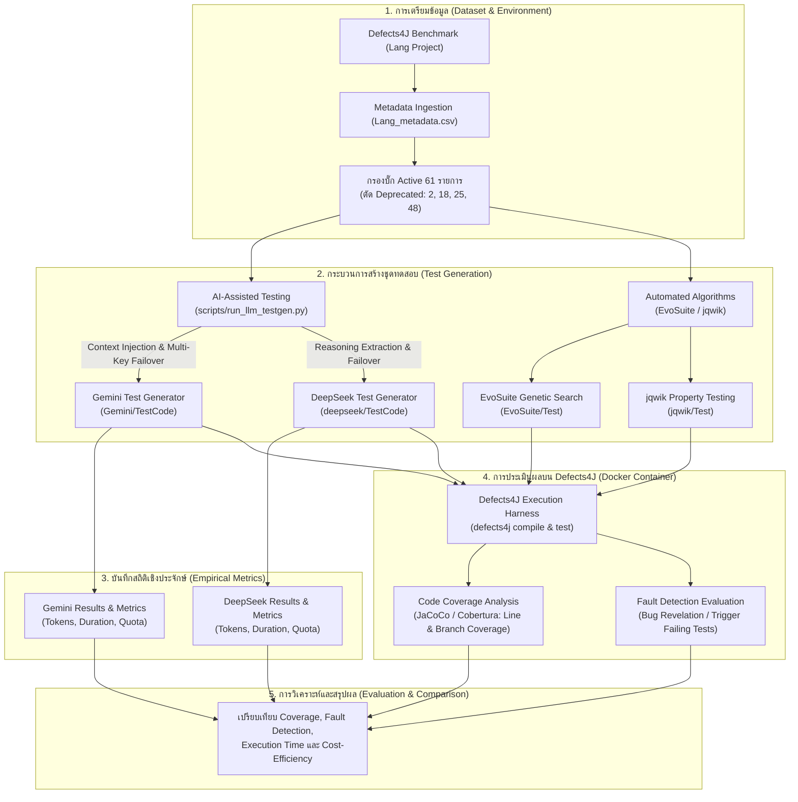

# ProjectSQA — AI-Assisted Testing vs. Automatic Test Case Generation Algorithms

**รายวิชา CP353201 Software Quality Assurance (ภาคการศึกษา 1/2569)**  
สาขาวิชาวิทยาการคอมพิวเตอร์ วิทยาลัยการคอมพิวเตอร์ มหาวิทยาลัยขอนแก่น (KKU)

---

## 👥 สมาชิกกลุ่ม
| รหัสนักศึกษา | ชื่อ-สกุล | หน้าที่ |
|---|---|---|
| 673380388-2 | กฤษฎา นามมนต์เทียน | LLM Test Generation & Pipeline Engineering |
| 673380392-1 | กานดิทัต นามสุดตา | Automated Tool Evaluation & Coverage Analysis |
| 673380402-4 | ดรัณภพ สุริเตอร์ | Benchmark Configuration & Defects4J Experimentation |

---

## 🎯 บทนำและวัตถุประสงค์ของโครงงาน

โครงงานนี้มีวัตถุประสงค์เพื่อศึกษา วิจัย และเปรียบเทียบเชิงประจักษ์ (Empirical Study) ระหว่างแนวทางการสร้างชุดการทดสอบซอฟต์แวร์ 2 รูปแบบหลัก:

1. **AI-Assisted Unit Test Generation (การใช้โมเดลภาษาขนาดใหญ่)**:
   - **Google Gemini**: ตัวแทน LLM สมรรถนะสูงที่มี Context Window ขนาดใหญ่และตอบสนองรวดเร็ว (ศึกษาผ่าน `gemini-3.7-flash` / `gemini-1.5-flash`)
   - **DeepSeek**: ตัวแทน LLM ที่โดดเด่นด้านการวิเคราะห์ตรรกะและการเขียนโค้ด (ศึกษาผ่าน `deepseek-v4-flash` / `deepseek-chat`)
2. **Automatic Test Case Generation Algorithms (เครื่องมือสร้างเคสทดสอบอัตโนมัติตามขั้นตอนวิธี)**:
   - **EvoSuite**: Search-based Software Testing โดยใช้อัลกอริทึมเชิงพันธุกรรม (Genetic Algorithm) มุ่งเน้นการสร้างชุดทดสอบเพื่อครอบคลุมเส้นทางการทำงาน (Branch & Mutation Coverage)
   - **jqwik**: Property-based Testing ซึ่งสุ่มและสร้างข้อมูลทดสอบ (Generators & Shrinking) เพื่อตรวจสอบคุณสมบัติสัจพจน์ (Invariants) ของซอฟต์แวร์

การทดลองทั้งหมดดำเนินการบน **Defects4J (v3.0.1)** ซึ่งเป็นชุดข้อมูลมาตรฐานสากลสำหรับงานวิจัยด้าน Software Testing & Bug Localization

---

## 📐 สถาปัตยกรรมและหลักการทำงานของระบบ (System Architecture)

กระบวนการทดลองถูกออกแบบเป็น Pipeline ตั้งแต่การเตรียมข้อมูล การสร้างชุดทดสอบ การรันประเมินความครอบคลุม ไปจนถึงการวิเคราะห์เปรียบเทียบผลลัพธ์:



### รายละเอียดหลักการทำงานสำคัญ:
1. **Context-Aware Prompt Injection**: สคริปต์ [run_llm_testgen.py](file:///d:/ProjectSQA/scripts/run_llm_testgen.py) จะนำข้อมูลเจาะลึกของแต่ละบั๊ก (คลาสที่ถูกแก้ไข, เมธอดทดสอบเดิมที่กระตุ้นให้พัง, สาเหตุข้อผิดพลาด) ป้อนเข้าไปใน Prompt เพื่อให้ LLM สังเคราะห์เคสทดสอบที่สามารถดักจับบั๊กจริงได้ตรงจุด
2. **Multi-Key Failover & Resilience**: จัดการปัญหา API Quota Exhaustion หรือ Rate Limit (HTTP 429) โดยระบบจะสลับ API Key โดยอัตโนมัติ ทำให้รันบั๊กทั้งหมด 61 ตัวได้อย่างราบรื่นและต่อเนื่อง
3. **Strict Compatibility Framing**: กำหนดเงื่อนไขระดับเข้มงวดให้ AI ส่งออกเฉพาะโค้ด **JUnit 4** และเข้ากันได้กับ **JDK 8** ภายใต้ Package เดียวกับคลาสเป้าหมาย เพื่อให้สามารถรันร่วมกับชุดทดสอบของ Defects4J ได้ทันที
4. **Comprehensive Metrics Tracking**: เก็บสถิติเวลาที่ใช้สร้าง (Generation Time), จำนวน Input/Output Tokens, และการใช้ Quota รายวัน บันทึกลงทั้งระดับรายไฟล์ Markdown และไฟล์ CSV สรุป

---

## 🔍 ขอบเขตการทดลอง (Scope of Experiment)

- **Benchmark**: Defects4J v3.0.1
- **Target Project**: Apache Commons `Lang` (61 Active Bugs)
  - รายการบั๊กที่ศึกษา: `Lang 1` ถึง `Lang 65` (ระบุไว้ใน [bugs.txt](file:///d:/ProjectSQA/bugs.txt))
  - บั๊กที่ถูกตัดออกเนื่องจาก Deprecated ใน Defects4J: **2, 18, 25, 48**
- **สภาพแวดล้อมระบบ**:
  - Runtime: Dockerized Ubuntu Environment with Java 11 / Java 8
  - Timezone กำหนดเป็น: `America/Los_Angeles` (ตามมาตรฐาน Defects4J)
- **เครื่องมือและโมเดลที่เปรียบเทียบ**:
  1. `Gemini` (โมเดล `gemini-3.7-flash` / `gemini-1.5-flash`)
  2. `DeepSeek` (โมเดล `deepseek-v4-flash` / `deepseek-chat`)
  3. `EvoSuite` (Search-based Genetic Algorithm)
  4. `jqwik` (Property-based Hypothesis Testing)

---

## 📂 โครงสร้างไดเรกทอรีและโมดูลต่าง ๆ

```
ProjectSQA/
├── README.md                      # เอกสารภาพรวมโครงการและคู่มือหลัก (ไฟล์นี้)
├── .env.example                   # ตัวอย่างการตั้งค่า API Keys และ Environment
├── bugs.txt                       # รายชื่อบั๊กโครงการ Lang ทั้งหมดที่นำมาทดสอบ (61 บั๊ก)
├── check_env.sh                   # สคริปต์ตรวจสอบความพร้อมของโฟลเดอร์และสภาพแวดล้อม
├── summarize_jqwik.py             # สคริปต์สรุปผลการรัน Coverage ของ jqwik
│
├── Gemini/                        # [โมดูล AI: Google Gemini] (ดู Gemini/README.md)
│   ├── README.md                  # เอกสารและหลักการทำงานของโมดูล Gemini
│   ├── Prompt/                    # แม่แบบ master_prompt.md และ actual prompts รายบั๊ก
│   ├── Result/                    # สถิติโทเคน, เวลา, execution_summary.json, CSV ผลลัพธ์
│   └── TestCode/                  # ซอร์สโค้ด JUnit 4 Test cases ที่สร้างโดย Gemini
│
├── deepseek/                      # [โมดูล AI: DeepSeek] (ดู deepseek/README.md)
│   ├── README.md                  # เอกสารและหลักการทำงานของโมดูล DeepSeek
│   ├── Prompt/                    # แม่แบบ master_prompt.md และ actual prompts รายบั๊ก
│   ├── Result/                    # สถิติโทเคน, เวลา, execution_summary.json, CSV ผลลัพธ์
│   └── TestCode/                  # ซอร์สโค้ด JUnit 4 Test cases ที่สร้างโดย DeepSeek
│
├── dataset/
│   └── defects4j/                 # Metadata ของ Defects4J (Lang_metadata.csv และโปรเจกต์อื่น ๆ)
│
├── scripts/
│   ├── run_llm_testgen.py         # สคริปต์หลักสำหรับสร้างชุดทดสอบด้วย Gemini & DeepSeek
│   ├── start_background_gen.bat   # สคริปต์รันสร้างชุดทดสอบเบื้องหลัง (Windows Batch)
│   └── start_background_gen.ps1   # สคริปต์รันสร้างชุดทดสอบเบื้องหลัง (PowerShell)
│
├── EvoSuite/                      # ชุดทดสอบและการตั้งค่าของ EvoSuite
│   ├── Configuration/             # คอนฟิกูเรชันพารามิเตอร์การค้นหา (Search Budget, Mutations)
│   ├── Result_Round1/             # ผลลัพธ์รอบที่ 1
│   ├── Result_Round2/             # ผลลัพธ์รอบที่ 2
│   └── Test/                      # โค้ดทดสอบที่สร้างโดย EvoSuite
│
├── jqwik/                         # ชุดทดสอบและผลลัพธ์ของ jqwik Property-based Testing
│   ├── Test/                      # โค้ดทดสอบแบบ Property-based
│   ├── Result_Round1/             # ผลลัพธ์รอบที่ 1
│   └── Result_Round2/             # ผลลัพธ์รอบที่ 2
│
└── docker/
    └── docker-compose.yml         # คอนฟิก Container สำหรับรัน Defects4J และ Java 8/11
```

> 📖 **รายละเอียดเฉพาะของแต่ละโมเดล AI**:
> - ศึกษาหลักการทำงานของ **Gemini** ได้ที่ [Gemini/README.md](file:///d:/ProjectSQA/Gemini/README.md)
> - ศึกษาหลักการทำงานของ **DeepSeek** ได้ที่ [deepseek/README.md](file:///d:/ProjectSQA/deepseek/README.md)

---

## 📊 ตัวชี้วัดการประเมินผล (Evaluation Metrics)

การประเมินและเปรียบเทียบผลลัพธ์จะวัดจาก 4 มิติหลัก:

| มิติการวัดผล | ตัวชี้วัด (Metrics) | วัตถุประสงค์และวิธีการวัด |
|---|---|---|
| **1. Code Coverage** | • Line Coverage (%)<br/>• Branch Coverage (%) | วัดสัดส่วนของคำสั่งและทางเลือกเงื่อนไขที่ถูกทดสอบผ่าน JaCoCo |
| **2. Fault Detection** | • Bug Detection Rate (%)<br/>• Trigger Failing Test | ตรวจสอบว่าชุดทดสอบสามารถทำให้บั๊กของ Defects4J แสดงอาการล้มเหลว (Fail) ตามที่คาดหมายได้หรือไม่ |
| **3. Test Suite Quality** | • Number of Assertions<br/>• Test Readability | จำนวนคำสั่งยืนยันผล (Assertion Density) และความอ่านเข้าใจง่ายของโค้ดทดสอบ |
| **4. Cost & Efficiency** | • Generation Time (sec)<br/>• Token Consumption (Tokens)<br/>• Compute Resource | ระยะเวลาที่ใช้ในการสังเคราะห์ชุดทดสอบ และต้นทุนการใช้งาน API |

---

## 🚀 เริ่มต้นใช้งานด่วน (Quick Start)

### 1. การเตรียมสภาพแวดล้อม (Environment Setup)
คัดลอกไฟล์ `.env.example` เป็น `.env` และกรอก API Keys ของ KKU IntelSphere หรือ Google/DeepSeek:
```bash
cp .env.example .env
```

### 2. รันระบบผ่าน Docker Container
```bash
# สตาร์ตคอนเทนเนอร์ Defects4J
docker compose -f docker/docker-compose.yml up -d --build

# เข้าสู่ Bash Shell ในคอนเทนเนอร์
docker compose -f docker/docker-compose.yml exec sqa bash

# ตรวจสอบความพร้อมของสภาพแวดล้อม
bash scripts/check_env.sh
```

### 3. การสร้างชุดทดสอบด้วย LLM (Gemini & DeepSeek)

```bash
# รันทั้งสองโมเดล (Gemini และ DeepSeek) สำหรับทุกบั๊กของ Lang
python scripts/run_llm_testgen.py --provider all --all

# รันเฉพาะโมเดล Gemini
python scripts/run_llm_testgen.py --provider gemini --all

# รันเฉพาะโมเดล DeepSeek
python scripts/run_llm_testgen.py --provider deepseek --all

# รันเฉพาะบั๊กเดี่ยว (ตัวอย่าง Lang บั๊กหมายเลข 1)
python scripts/run_llm_testgen.py --provider gemini --bug 1

# ทดลองรันแบบ Dry-Run (สร้างเฉพาะ Prompt โดยไม่ส่ง API Call จริง)
python scripts/run_llm_testgen.py --provider all --all --dry-run
```

### 4. การรันเบื้องหลัง (Background Execution บน Windows)
หากต้องการปล่อยให้ระบบสร้างชุดทดสอบต่อเนื่อง สามารถรันผ่านสคริปต์เบื้องหลัง:
```powershell
# ผ่าน PowerShell
powershell -ExecutionPolicy Bypass -File scripts/start_background_gen.ps1

# หรือผ่าน Batch File
scripts\start_background_gen.bat
```

---
*โครงงานนี้เป็นส่วนหนึ่งของการศึกษาในวิชา CP353201 Software Quality Assurance วิทยาลัยการคอมพิวเตอร์ มหาวิทยาลัยขอนแก่น*
