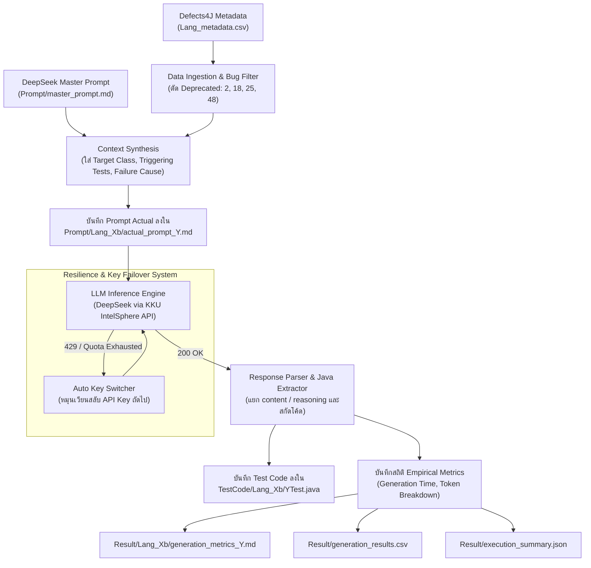

# 🧠 DeepSeek Test Generation Module

โมดูลสำหรับการสร้างชุดการทดสอบอัตโนมัติ (Automated Unit Test Generation) สำหรับ Java โดยใช้โมเดลตระกูล **DeepSeek** (เช่น `deepseek-v4-flash`, `deepseek-chat`) ผ่าน KKU IntelSphere API / DeepSeek API เพื่อนำไปประเมินผลบนชุดทดสอบมาตรฐาน **Defects4J**

---

## 📌 สารบัญ
- [1. ภาพรวมและบทบาทในโครงการ](#1-ภาพรวมและบทบาทในโครงการ)
- [2. โครงสร้างไดเรกทอรี](#2-โครงสร้างไดเรกทอรี)
- [3. สถาปัตยกรรมและหลักการทำงาน](#3-สถาปัตยกรรมและหลักการทำงาน)
- [4. กลยุทธ์การออกแบบ Prompt และ Code Reasoning](#4-กลยุทธ์การออกแบบ-prompt-และ-code-reasoning)
- [5. ข้อมูลการวัดผลและสถิติ (Metrics Tracking)](#5-ข้อมูลการวัดผลและสถิติ-metrics-tracking)
- [6. วิธีการใช้งานและคำสั่งที่เกี่ยวข้อง](#6-วิธีการใช้งานและคำสั่งที่เกี่ยวข้อง)

---

## 1. ภาพรวมและบทบาทในโครงการ

โมดูลนี้ทำหน้าที่เป็นตัวแทนของแนวทาง **AI-Assisted Software Testing** โดยใช้ความสามารถขั้นสูงด้านการประมวลผลโค้ด (Code Intelligence) และการคิดเชิงเหตุผล (Reasoning Capabilities) ของ DeepSeek มาสังเคราะห์คลาสทดสอบระดับยูนิต (JUnit 4) แบบอัตโนมัติ

ในการวิจัยโครงงานนี้ โมเดล DeepSeek ถูกนำมาประเมินเปรียบเทียบในมิติต่าง ๆ:
1. **เปรียบเทียบกับโมเดล Gemini**: ด้านความแม่นยำในการตรวจจับบั๊ก (Bug Revelation), ความซับซ้อนของ Test Assertions, ระยะเวลาสร้าง (Latency), และอัตราการใช้โทเคน (Token Consumption)
2. **เปรียบเทียบกับอัลกอริทึมดั้งเดิม**: EvoSuite (Search-based Genetic Algorithm) และ jqwik (Property-based Hypothesis Testing)

---

## 2. โครงสร้างไดเรกทอรี

```
deepseek/
├── README.md                                 # เอกสารอธิบายการทำงานของโมดูล DeepSeek (ไฟล์นี้)
├── Prompt/                                   # โฟลเดอร์จัดเก็บ Prompt Templates และ Prompt จริงที่ส่งให้ AI
│   ├── master_prompt.md                      # แม่แบบ Prompt หลักที่กำหนดบทบาท ข้อจำกัด และเงื่อนไขของ JUnit 4
│   └── <Project>_<BugID>b/                   # Prompt รายบั๊ก (เช่น Lang_1b, Chart_1b)
│       └── actual_prompt_<ClassName>.md      # เนื้อหา Prompt จริงที่ Render ข้อมูลบั๊กแล้ว
├── Result/                                   # บันทึกผลลัพธ์ สถิติโทเคน และระยะเวลา
│   ├── execution_summary.json                # สรุปภาพรวมโทเคน เวลา และจำนวนบั๊กที่ประมวลผลสำเร็จ
│   ├── generation_results.csv                # ตารางสรุปผลการรันระดับรายบั๊ก (Status, Duration, Tokens)
│   ├── generator_deepseek_allprojects.log    # บันทึกเหตุการณ์ (Log) ระหว่างกระบวนการสร้างชุดทดสอบ
│   └── <Project>_<BugID>b/                   # โฟลเดอร์ผลลัพธ์รายบั๊ก
│       └── generation_metrics_<ClassName>.md # รายงานเวลา, Token Usage (Prompt/Completion) และ Quota
└── TestCode/                                 # ซอร์สโค้ดไฟล์การทดสอบ JUnit 4 ที่ AI สร้างขึ้น
    └── <Project>_<BugID>b/
        └── <ClassName>Test.java              # ไฟล์คลาสทดสอบที่พร้อมนำไปคอมไพล์และรันใน Defects4J
```

---

## 3. สถาปัตยกรรมและหลักการทำงาน

การทำงานของโมดูล DeepSeek ขับเคลื่อนโดย [run_llm_testgen.py](file:///d:/ProjectSQA/scripts/run_llm_testgen.py) โดยมี Pipeline การทำงานดังนี้:



### กลไกสำคัญในการทำงาน:
1. **Context & Failure Knowledge Injection**: นำข้อมูลประวัติบั๊กของ Defects4J เช่น เมธอดที่เฟล (`tests_trigger`) และสาเหตุของข้อผิดพลาด (`tests_trigger_cause`) ป้อนเป็นบริบท เพื่อให้ DeepSeek วิเคราะห์จุดบกพร่องเชิงตรรกะได้ลึกซึ้งยิ่งขึ้น
2. **Deep Reasoning Extraction**: DeepSeek มีกลไกการคิดเชิงตรรกะภายใน สคริปต์รองรับการดึงทั้ง `message.content` และ `message.reasoning` เพื่อให้มั่นใจว่าจะได้บล็อกโค้ด Java ที่สมบูรณ์ที่สุด
3. **Automated Quota & Rate Limit Handling**: หากเรียก API แล้วติดสถานะ 401, 403, 429 หรือมีข้อความแจ้งเตือนโควต้าหมด ระบบจะสลับไปยัง Token ถัดไปทันทีโดยอัตโนมัติ ทำให้สามารถรันต่อเนื่องได้ครบทุกบั๊กแบบ Unattended Execution
4. **Code Normalization**: สกัดโค้ดภาษา Java ออกจากบล็อก Markdown และตรวจสอบความเข้ากันได้กับ JUnit 4 ก่อนบันทึกลง `TestCode/`

---

## 4. กลยุทธ์การออกแบบ Prompt และ Code Reasoning

Prompt แม่แบบตั้งอยู่ที่ [deepseek/Prompt/master_prompt.md](file:///d:/ProjectSQA/deepseek/Prompt/master_prompt.md) ซึ่งได้รับการออกแบบมาเพื่อดึงศักยภาพสูงสุดของโมเดลตรรกะ:

1. **Role Framing**: กำหนดให้เป็น Senior SQA Engineer ที่เชี่ยวชาญการทดสอบ Defects4J
2. **Dual-Goal Directive**:
   - บรรลุ **High Coverage** ทั้งในส่วนของ Statement Coverage และ Branch Coverage
   - เจาะจงการสร้าง Assertion ที่กระตุ้นให้เกิด **Fault Detection** ในบั๊กของ Defects4J
3. **Strict Constraints**:
   - บังคับใช้ **JUnit 4** และ **JDK 8** (เพื่อรองรับการรันร่วมกับชุดทดสอบเดิมของ Defects4J Lang)
   - ห้ามพิมพ์ข้อความเกริ่นนำหรือสรุป ให้พิมพ์เฉพาะซอร์สโค้ดภาษา Java ภายในบล็อก ` ```java ... ``` `
   - แพ็กเกจของคลาสทดสอบต้องตรงกับคลาสต้นฉบับทุกประการ
4. **Targeted Testing Vectors**:
   - การจัดการกรณีขอบเขต (Boundary limits, Negative numbers, Integer Overflow)
   - ข้อมูลว่างและ Null pointers
   - การทดสอบทางเลือกใน Decision Points (if/else, switch-case, exception handling)

---

## 5. ข้อมูลการวัดผลและสถิติ (Metrics Tracking)

ในไดเรกทอรี `Result/` มีการจัดเก็บสถิติเชิงประจักษ์อย่างเป็นระบบ:

### 1. ไฟล์รายบั๊ก (`Result/<Project>_<BugID>b/generation_metrics_<ClassName>.md`)
แสดงรายละเอียดค่าที่วัดได้จริงจากการเรียก API:
- **เวลาที่ใช้สร้าง (Generation Time)**: จับเวลาหน่วยเป็นวินาที
- **Input Tokens (Prompt + Source Code)**: คืนค่าจาก API (`usage.prompt_tokens`)
- **Output Tokens (Generated Test Code)**: คืนค่าจาก API (`usage.completion_tokens`)
- **Total Tokens**: จำนวนโทเคนรวมที่ใช้ไป
- **สถานะการสร้าง**: สถานะการสกัดบล็อกโค้ด JUnit 4
- **Token Quota ประจำวัน**: แสดงโควต้าที่ใช้ไปและโควต้าคงเหลือของ Token Slot นั้น

### 2. สรุปภาพรวม (`Result/generation_results.csv` และ `Result/execution_summary.json`)
บันทึก Bug ID, Target Class, Status, Duration, Tokens และ Timestamp สำหรับนำไปทำกราฟสรุปและรายงานผลเชิงสถิติ

---

## 6. วิธีการใช้งานและคำสั่งที่เกี่ยวข้อง

### การรันสร้าง Test Cases ด้วย DeepSeek

1. **ตั้งค่า API Key ในไฟล์ `.env`**:
   ```bash
   KKU_API_KEYS=sk_xxx1,sk_xxx2
   INTELSPHERE_DEEPSEEK_MODEL=deepseek-v4-flash
   ```

2. **รัน DeepSeek สำหรับ Project Lang ทุกบั๊ก**:
   ```bash
   python scripts/run_llm_testgen.py --provider deepseek --all
   ```

3. **รันเฉพาะบั๊กเดี่ยว (เช่น Lang Bug ID 1)**:
   ```bash
   python scripts/run_llm_testgen.py --provider deepseek --bug 1
   ```

4. **บังคับเขียนทับไฟล์เดิม (Force Overwrite)**:
   ```bash
   python scripts/run_llm_testgen.py --provider deepseek --bug 1 --force
   ```

5. **Dry-Run (ทดสอบการ Generate Prompt โดยไม่ส่ง API Call)**:
   ```bash
   python scripts/run_llm_testgen.py --provider deepseek --all --dry-run
   ```

---
*เอกสารนี้เป็นส่วนหนึ่งของโครงงาน CP353201 Software Quality Assurance (KKU)*
